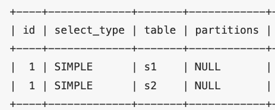
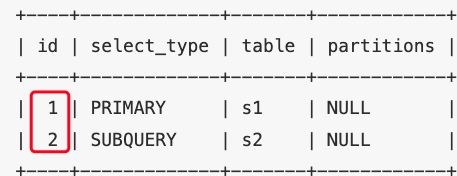
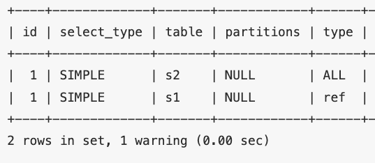

## Explain 的使用

​		一条查询语句在经过`MySQL`查询优化器的各种基于成本和规则的优化会后生成一个所谓的`执行计划`，这个执行计划展示了接下来具体执行查询的方式。

​		通过在查询语句之前加上`explain`即可：

```sql
explain select * from table_name;
```

| 列              | 描述                                                   |
| --------------- | ------------------------------------------------------ |
| `select_type`   | `SELECT`关键字对应的那个查询的类型                     |
| `table`         | 表名                                                   |
| `partitions`    | 匹配的分区信息                                         |
| `type`          | 针对单表的访问方法                                     |
| `possible_keys` | 可能用到的索引                                         |
| `key`           | 实际上使用的索引                                       |
| `key_len`       | 实际使用到的索引长度                                   |
| `ref`           | 当使用索引列等值查询时，与索引列进行等值匹配的对象信息 |
| `rows`          | 预估的需要读取的记录条数                               |
| `filtered`      | 某个表经过搜索条件过滤后剩余记录条数的百分比           |
| `Extra`         | 一些额外的信息                                         |
| `id`            | 每个`SELECT`关键字都对应一个唯一的`id`                 |

## explain 各列详解

### table

​		不论查询语句多复杂，里边包含了多少个表，到最后也是需要对每个表进行单表访问的，`MySQL`规定`EXPLAIN`语句输出的每条记录都对应着某个单表的访问方法，该条记录的table列代表着该表的表名

### id	

​		查询语句中每出现一个`SELECT`关键字，`MySQL`就会为它分配一个唯一的`id`值。

​		多表连接查询，参与连接的表分别对应一条记录，但是这些记录对应的 id 是相同的。出现在前边的表表示驱动表，出现在后边的表表示被驱动表。

```sql
EXPLAIN SELECT * FROM s1 INNER JOIN s2;
```

​		

​		对于包含子查询的查询语句来说，就可能涉及多个`SELECT`关键字，所以在包含子查询的查询语句的执行计划中，每个`SELECT`关键字都会对应一个唯一的`id`值：

```sql
EXPLAIN SELECT * FROM s1 WHERE key1 IN (SELECT key1 FROM s2) OR key3 = 'a';
```



> **查询优化器可能对涉及子查询的查询语句进行重写，从而转换为连接查询**。所以如果想知道查询优化器对某个包含子查询的语句是否进行了重写，直接查看执行计划就好了
>
> ```sql
> EXPLAIN SELECT * FROM s1 WHERE key1 IN (SELECT key3 FROM s2 WHERE common_field = 'a');
> ```
>
> 

### select_type

​		一条大的查询语句里可以包含若干个`SELECT`关键字，每个`SELECT`关键字代表着一个小的查询语句，而每个`SELECT`关键字的`FROM`子句中都可以包含若干张表（这些表用来做连接查询），每一张表都对应着执行计划输出中的一条记录，对于在同一个`SELECT`关键字中的表来说，它们的`id`值是相同的。

​		`MySQL`为每一个`SELECT`关键字代表的小查询都定义了一个称之为`select_type`的属性，只要知道了某个小查询的`select_type`属性，就知道了这个小查询在整个大查询中扮演了一个什么角色。

select_type 主要的可选值有：

- SIMPLE：