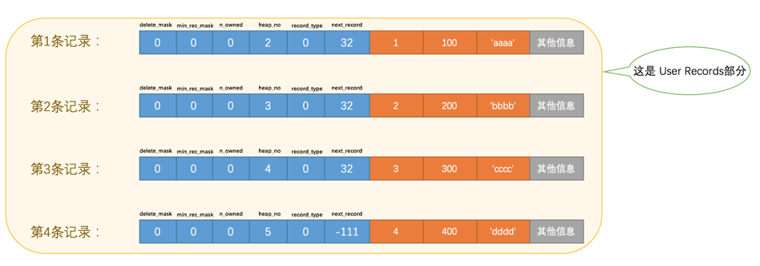
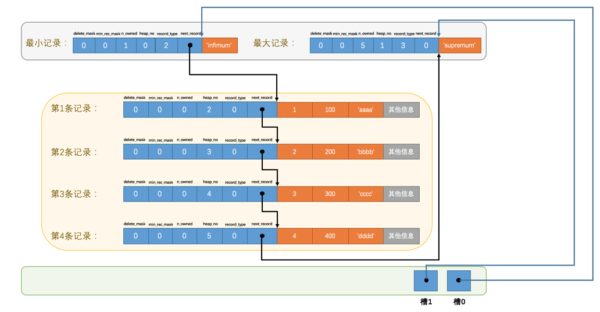

## 页结构

页大小为`16KB`，`InnoDB`为了不同的目的而设计了许多种不同类型的`页`，比如存放表空间头部信息的页，存放`Insert Buffer`信息的页，存放`INODE`信息的页，存放`undo`日志信息的页等...

### User Records

存储的记录会按照指定的`行格式`存储到`User Records`部分。

#### 记录头信息

- delete_mask:删除标志，当一条记录被删除时，并**不会立即被真正的删除**，而是将该位置 1，视为被删除的记录（加入到被删除的记录链表中），之后再次插入记录时将会复用这部分空间

- min_rec_mask:B+树的每层非叶子节点中的最小记录都会添加该标记

- n_owned：表示当前记录拥有的记录数。在一个页面中，记录是以“组”的形式存在的，每个组中“主键”最大的记录才使用该位，标记本组内共有多少条记录

- heap_no:表示当前记录在本`页`中的位置，从下图中可以看出来，插入的4条记录在本页中的位置分别是：`2`、`3`、`4`、`5`

  

- record_type:表示当前记录的类型：

  - 0：表示`普通记录`，也就是数据记录

  - 1：表示`B+树非叶节点记录`也就是说该记录存的是索引

  - 2：表示`最小记录`，每个页默认有一个最小记录

  - 3：表示`最大记录`，同样每个页默认有一个最大记录

    > 由于这两个记录并不是我们自己插入的，所以有时候也称为`伪记录`或者`虚拟记录`
    >
    > 最小记录和最大记录类似于为链表添加头结点和尾节点，不是用户插入的数据，只是为了维护数据结构

- next_record：表示**下一条记录**的相对位置，可以认为是链表中的“**next指针**”，指向了下一条记录的**数据**位置，同样的，在删除的记录中，通过该位也得到了删除记录的链表。

  - 注意：`下一条记录`指的并不是插入顺序的下一条记录，而是按照主键值由小到大的顺序的下一条记录。而且规定 ***Infimum记录（也就是最小记录）*** 的下一条记录就是本页中主键值最小的用户记录，而本页中主键值最大的用户记录的下一条记录就是 ***Supremum记录（也就是最大记录）***

  > 思考：**为什么 next_record 指向的是下一条记录的数据位置而不是下一条记录头的位置？**
  >
  > 答：因为这个位置刚刚好，**向左读取就是记录头信息，向右读取就是真实数据**。前边说过变长字段长度列表、NULL值列表中的信息都是逆序存放，这样可以使记录中位置靠前的字段和它们对应的字段长度信息在内存中的距离更近，可能会**提高高速缓存的命中率**。

### Free Space

在一开始生成页的时候，其实并没有`User Records`这个部分，每当插入一条记录，都会从`Free Space`部分，也就是尚未使用的存储空间中申请一个记录大小的空间划分到`User Records`部分，当`Free Space`部分的空间全部被`User Records`部分替代掉之后，也就意味着这个页使用完了。

### Infirmum + Supermum

由于`最小记录`和`最大记录`不是我们自己定义的记录，所以它们并不存放在`User Records`部分，而是存在此处。

### Page Directory

​	数据记录在页中按照主键值大小被顺序串成了一个单链表，而页目录就是为了方便从有序的单链表中查找某条数据而设计的（类比 B +树结构）。

​	实现快速查找过程：

1. 将所有正常的记录（包括最大和最小记录，不包括标记为已删除的记录）划分为几个组。

2. 每个组的最后一条记录（也就是组内最大的那条记录）的头信息中的`n_owned`属性表示该记录拥有多少条记录，也就是该组内共有几条记录。

3. 将每个组的最后一条记录的地址偏移量单独提取出来按顺序存储到靠近页尾部的地方，这个地方就是所谓的`Page Directory`，页面目录中的这些地址偏移量被称为`槽`（英文名：`Slot`），所以这个页面目录就是由槽组成的。

4. 查找时通过二分法查找出数据所在的分组然后遍历分组内所有的记录

   

> 每个分组中的记录条数是有规定的：对于最小记录所在的分组只能有 ***1*** 条记录，最大记录所在的分组拥有的记录条数只能在 ***1~8*** 条之间，剩下的分组中记录的条数范围只能在是 ***4~8*** 条之间，分组的过程类似于向 B+树中不断插入数据，只不过页内的这种 B+树只有两层，第一层是由槽组成的索引，第二层是记录

### Page Header

这个部分占用固定的`56`个字节，专门存储各种状态信息。部分如下：

- PAGE_N_DIR_SLOTS:在页目录中的槽数量
- PAGE_HEAD_TOP:还未使用的空间最小地址(后面就是 Free Space)
- PAGE_N_HEAD:本页中的记录的数量（包括最小和最大记录以及标记为删除的记录）
- PAGE_FREE:第一个已经标记为删除的记录地址(也就是删除的记录的头结点)
- PAGE_N_RECS:该页中记录的数量（不包括最小和最大记录以及被标记为删除的记录）
- PAGE_MAX_TRX_ID:修改当前页的最大事务ID，该值仅在二级索引中定义
- PAGE_LEVEL:当前页在B+树中所处的层级
- PAGE_INDEX_ID:索引ID，表示当前页属于哪个索引
- PAGE_BTR_SEG_LEAF:B+树叶子段的头部信息，仅在B+树的Root页定义
- PAGE_BTR_SEG_TOP:B+树非叶子段的头部信息，仅在B+树的Root页定义

### File Header

​	针对各种类型的页都通用，也就是说不同类型的页都会以`File Header`作为第一个组成部分，它描述了一些针对各种页都通用的一些信息。部分信息如下：

- FIL_PAGE_SPACE_OR_CHKSUM:页的校验和

  - 用来对整个页做数据校验

- FIL_PAGE_OFFSET:页号

  - InnoDB 通过页号来定位一个具体的页

- FIL_PAGE_PREV:上个页的页号

- FIL_PAGE_NEXT:下个页的页号

  > 相当于双向链表，将物理上不连续的页串起来

- FIL_PAGE_TYPE:该页的类型，如数据页、索引页、日志页、溢出页等等

### FileTrailer

​	`InnoDB`存储引擎会把数据存储到磁盘上，但是磁盘速度太慢，需要以`页`为单位把数据加载到内存中处理，如果该页中的数据在内存中被修改了，那么在修改后的某个时间需要把数据同步到磁盘中。但是**在同步了一半的时候中断电了咋办？**为了检测一个页是否完整（也就是在同步的时候有没有发生只同步一半的尴尬情况），在每个页的尾部都加了一个`File Trailer`部分

由`8`个字节组成，可以分成2个小部分：

- 前4 字节表示校验和，对应于 File Header中的校验和字段，写入磁盘时先将 File Header中的校验和写入，然后写入数据，最后再将校验和写入 File Trailer，如果完全同步成功，则页的首部和尾部的校验和应该是一致的。
- 后4个字节代表页面被最后修改时对应的日志序列位置（LSN）

### 参考

[InnoDB数据页结构](https://juejin.cn/book/6844733769996304392/section/6844733770046636046)

