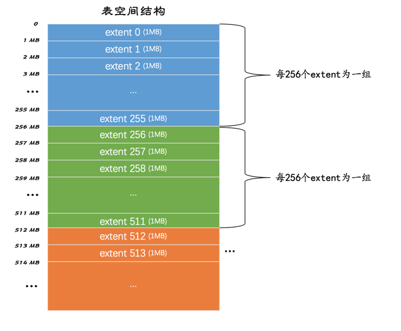
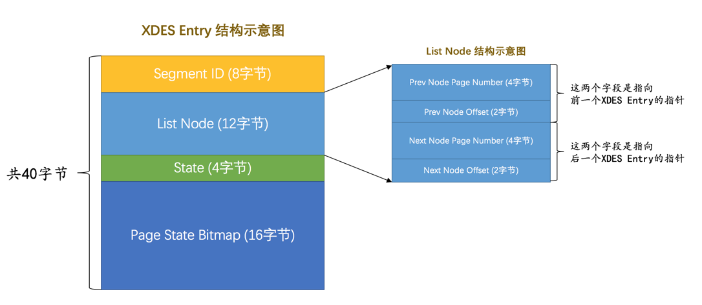
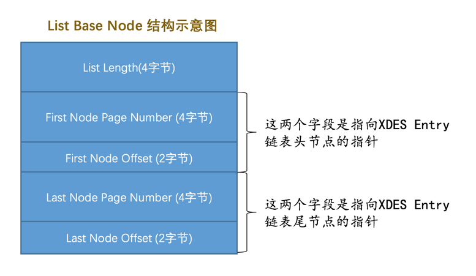
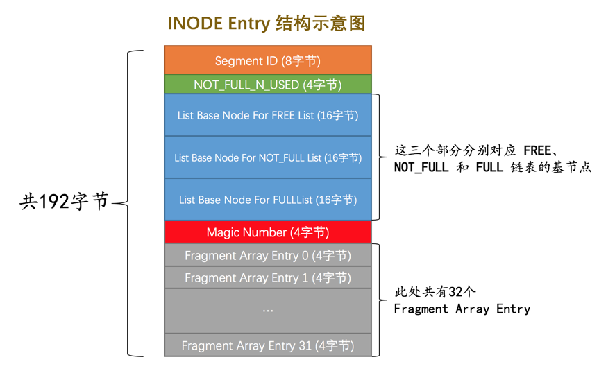

## 独立表空间结构

### 区（extent）、组

> 引入区的概念是为了让链表中相邻的页面离得更近，以减少随机 IO 的开销；在表中数据量大的时候，为某个索引分配空间的时候就不再按照页为单位分配了，而是按照`区`为单位分配，甚至在表中的数据十分非常特别多的时候，可以一次性分配多个连续的区。虽然可能造成一点点空间的浪费（数据不足填充满整个区），但是从性能角度看，可以消除很多的随机IO

- 一个页大小为 16KB，64 个页组成一个区（1MB）
- 256 个区为一组



- 第一个组的前三个页面固定，分别为：
  - FSP_HDR类型
  - IBUF_BITMAP 类型
  - INODE 类型
- 其余各个组的开始两个页面固定，分别为：
  - XDES 类型
  - IBUF_BITMAP 类型

### 段和碎片区

> 引入段的概念，是为了区分叶子节点和非叶子节点；
>
> 范围查询，其实是对`B+`树叶子节点中的记录进行顺序扫描，而如果不区分叶子节点和非叶子节点，统统把节点代表的页面放到申请到的区中的话，进行范围扫描的效果就大打折扣

叶子节点有自己独有的`区`，非叶子节点也有自己独有的`区`。

存放叶子节点的区的集合就算是一个`段`（`segment`），存放非叶子节点的区的集合也算是一个`段`。也就是说**一个索引会生成2个段**，一个叶子节点段，一个非叶子节点段。

> 引入碎片区的概念，是为了充分利用空间，当表中数据量很小时，分配一个区太浪费。在**一个碎片区中，并不是所有的页都是为了存储同一个段的数据而存在的，而是碎片区中的页可以用于不同的目的**，比如有些页用于段A，有些页用于段B，有些页甚至哪个段都不属于。
>
> **碎片区直属于表空间，并不属于任何一个段**

为段分配存储空间的策略如下:

- 最开始时，段是从某个碎片区以单个页面为单位来分配存储空间的
- 当某个段已经占用了32个碎片区页面之后，就会以完整的区为单位来分配存储空间

因此，段的定义可以认为是**某些零散的页面以及一些完整的区的集合**

### 区的分类

表空间是由若干个区组成的，这些区可分为 4 类：

- 空闲区：现在还没有用到这个区中的任何页面（可以被分配）
- 有剩余空间的碎片区：区中还有可用的页面。
- 没有剩余空间的碎片区：区中页面已经用尽
- 附属于某个段的区：这些区附属于某个段

通过 state 记录区的类型：

- FREE
- FREE_FRAG
- FULL_FRAG
- FSEG

> 处于`FREE`、`FREE_FRAG`以及`FULL_FRAG`这三种状态的区都是独立的，算是直属于表空间；而处于`FSEG`状态的区是附属于某个段的

### XDES Entry

为了管理区的一个结构



- Segment ID :段 ID，唯一标识某个段

- ListNode:记录了上一个 XDES和下一个 XDES 的位置（双链表）

  - 4 字节的 Number 标识页号，2 字节的 Offset 标识页内偏移

  这样就能定位表空间内的某个位置

- State：标识这个区的类型

- Page State Bitmap：16个字节，也就是128个比特位。一个区有64个页，这128个比特位被划分为64个部分，每个部分2个比特位，对应区中的一个页。比特位的第一个位表示对应的页是否是空闲的，第二个比特位还没有用

### 向表中插入数据的过程

- 当段中数据较少的时候：

  - 如果存在还有**空闲空间的碎片区（FREE_FRAG）**，那么从该区中取一些零散的页把数据插进去；
  - 否则到表空间下申请一个**空闲的区（FREE）**，把该区的状态变为`FREE_FRAG`，然后从该新申请的区中取一些零散的页把数据插进去。之后不同的段使用零散页的时候都会从该区中取，直到该区中没有空闲空间，然后该区的状态就变成了`FULL_FRAG`

  > 如何查找是否存在空闲的碎片区或者空闲的区？
  >
  > 答：通过XDES Entry 结构中的 ListNode,得到三个链表：
  >
  > - 将FREE 状态的区连成一个链表
  > - 将FREE_FRAG 状态的区连成一个链表
  > - 将FREE_FULL 状态的区连成一个链表

- 当段中数据已经占满了32个零散的页后，就直接申请完整的区来插入数据了

  > 如何知道哪些区属于哪个段的呢？
  >
  > 答：**每个段都有它独立的链表**，所以可以根据段号（也就是`Segment ID`）来建立链表，有多少个段就建多少个链表；
  >
  > 继续细分，为每个段中的区对应的`XDES Entry`结构建立了三个链表：
  >
  > - FREE 链表：所有页面都是空闲的区对应的`XDES Entry`结构会被加入到这个链表。
  > - NOT_FULL链表：同一个段中，仍有空闲空间的区对应的`XDES Entry`结构会被加入到这个链表
  > - FULL 链表：同一个段中，已经没有空闲空间的区对应的`XDES Entry`结构会被加入到这个链表。
  >
  > **此处的链表是附属于某个段的**，而不是直属于表空间

```c
表空间|
		 |----->FREE_LIST
		 |----->FREE_FRAG_LIST
		 |----->FREE_FULL_LIST
		 |
		 |--------段空间|
		 |			   		 |------>FREE_LIST
		 |						 |------>NOT_FULL_LIST
		 |						 |------>FULL_LIST
		 |				...			
		 |--------段空间|...
```

### 链表基节点

List Base Node 结构用于记录上述链表的信息：



因此，只需要将基节点放置在表空间中**固定的位置**，这样想找定位某个链表就变得十分容易

### 段的结构

段不对应表空间中某一个连续的物理区域，而是一个**逻辑上的概念**，通过 INODE 来记录一下段中的属性：



- Segment ID：段 ID
- NOT_FULL_N_USED:记录在 NOT_FULL链表中已经用了多少个页
- 3 个 List Base Node：用于记录三个链表的头结点
- Magic Number：魔数，记录这个段结构是否已经被初始化了
- Fragment Array Entry：段是一些零散页面和一些完整的区的集合，每个Fragment Array Entry结构都**对应着一个零散的页面**，这个结构一共4个字节，表示一个零散页面的页号（超过 32 页时，将以区为单位分配空间）

