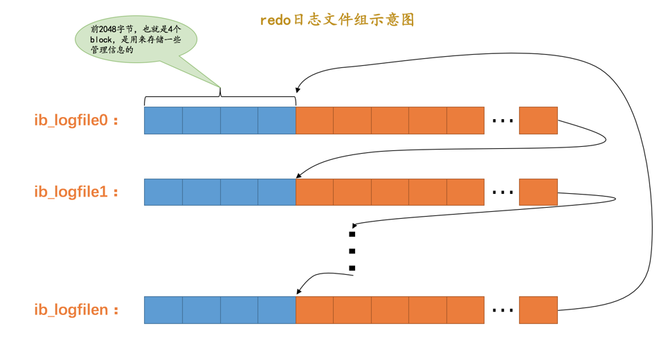
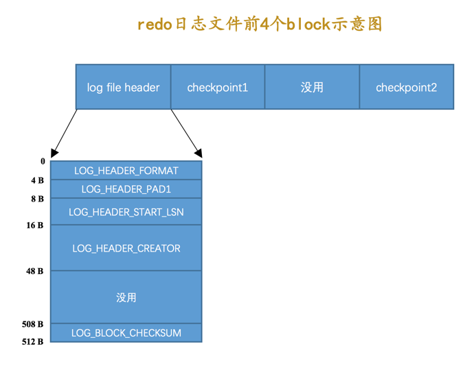

## 为什么需要 Redo 日志

​		`InnoDB`存储引擎是以页为单位来管理存储空间的，进行的增删改查操作其实本质上都是在访问页面（包括读页面、写页面、创建新页面等操作）。在真正访问页面之前，需要把在磁盘上的页缓存到内存中的`Buffer Pool`之后才可以访问。事务中有一个称之为`持久性`的特性，就是说对于一个已经提交的事务，在事务提交后即使系统发生了崩溃，这个事务对数据库中所做的更改也不能丢失。但是如果我们只在内存的`Buffer Pool`中修改了页面，假设在事务提交后突然发生了某个故障，导致内存中的数据都失效了，那么这个已经提交了的事务对数据库中所做的更改也就跟着丢失了，那么如何保证这个`持久性`呢？

​		一个很简单的做法就是在事务提交完成之前把该事务所修改的所有页面都刷新到磁盘，但是这个简单粗暴的做法有些问题：

- 刷新一个完整的数据页太浪费了

  有时候仅仅修改了某个页面中的一个字节，但是在`InnoDB`中是**以页为单位来进行磁盘IO的**，也就是说我们在该事务提交时不得不将一个完整的页面从内存中刷新到磁盘，一个页面默认是16KB大小，只修改一个字节就要刷新16KB的数据到磁盘上显然是太浪费了。

- 随机IO刷起来比较慢

  一个事务可能包含很多语句，即使是一条语句也可能修改许多页面，该事务修改的这些页面可能并不相邻，这就意味着在将某个事务修改的`Buffer Pool`中的页面刷新到磁盘时，需要进行很多的随机IO，随机IO比顺序IO要慢，尤其对于传统的机械硬盘来说。

因此，没有必要在每次事务提交时就把该事务在内存中修改过的全部页面刷新到磁盘，**只需要把修改了哪些东西记录一下就好**。这样在事务提交时，把上述内容刷新到磁盘中，即使之后系统崩溃了，**重启之后只要按照上述内容所记录的步骤重新更新一下数据页，那么该事务对数据库中所做的修改又可以被恢复出来**，也就意味着满足`持久性`的要求。因为在系统崩溃重启时需要按照上述内容所记录的步骤重新更新数据页，所以上述内容也被称之为`重做日志`，英文名为`redo log`

其优点有两个：

- `redo`日志占用的空间非常小

  存储表空间ID、页号、偏移量以及需要更新的值所需的存储空间很小

- `redo`日志是顺序写入磁盘的

  在执行事务的过程中，每执行一条语句，就可能产生若干条`redo`日志，这些日志是按照产生的顺序写入磁盘的，也就是使用顺序IO。

## Redo 日志格式

- type：redo日志的类型
- space ID：表空间ID
- page number：页号
- data：日志的具体内容

### 简单的 redo 日志类型

​		根据`InnoDB`的记录行格式，如果我们没有为某个表显式的定义主键，并且表中也没有定义`Unique`键，那么`InnoDB`会自动的为表添加一个称之为`row_id`的隐藏列作为主键。为这个`row_id`隐藏列赋值的方式如下：

- 服务器会在**内存中维护一个全局变量**，每当向某个包含隐藏的`row_id`列的表中插入一条记录时，就会把该变量的值当作新记录的`row_id`列的值，并且把该变量自增1。
- 每当这个变量的值为256的倍数时，就会将该变量的值刷新到系统表空间的页号为`7`的页面中一个称之为`Max Row ID`的属性处。
- 当系统启动时，会将上边提到的`Max Row ID`属性加载到内存中，将该值加上256之后赋值给全局变量（**因为在上次关机时该全局变量的值可能大于`Max Row ID`属性值**）。

这个`Max Row ID`属性占用的存储空间是8个字节，当某个事务向某个包含`row_id`隐藏列的表插入一条记录，并且为该记录分配的`row_id`值为256的倍数时，就会向系统表空间页号为7的页面的相应偏移量处写入8个字节的值。但是这个写入实际上是在`Buffer Pool`中完成的，我们需要为这个页面的修改记录一条`redo`日志，以便在系统崩溃后能将已经提交的该事务对该页面所做的修改恢复出来。**这种情况下对页面的修改是极其简单的，`redo`日志中只需要记录一下在某个页面的某个偏移量处修改了几个字节的值**，以及具体被修改的内容就好了。这类日志称之为**`物理日志`**，并且根据在页面中写入数据的多少划分了几种不同的`redo`日志类型：

- `MLOG_1BYTE`（`type`字段对应的十进制数字为`1`）：表示在页面的某个偏移量处写入1个字节的`redo`日志类型。

- `MLOG_2BYTE`（`type`字段对应的十进制数字为`2`）：表示在页面的某个偏移量处写入2个字节的`redo`日志类型。

- `MLOG_4BYTE`（`type`字段对应的十进制数字为`4`）：表示在页面的某个偏移量处写入4个字节的`redo`日志类型。

- `MLOG_8BYTE`（`type`字段对应的十进制数字为`8`）：表示在页面的某个偏移量处写入8个字节的`redo`日志类型。

  

- `MLOG_WRITE_STRING`（`type`字段对应的十进制数字为`30`）：表示在页面的某个偏移量处写入一串数据

  

  因为不能确定写入的具体数据占用多少字节，所以需要在日志结构中添加一个`len`字段

### 复杂的 redo 日志类型

​		有时候执行一条语句会修改非常多的页面，包括系统数据页面和用户数据页面等，例如一次插入记录：

如果使用简单的物理`redo`日志来记录这些修改时，可以有两种解决方案：

- 方案一：在每个修改的地方都记录一条`redo`日志。

  也就是如上图所示，有多少个加粗的块，就写多少条物理`redo`日志。这样记录`redo`日志的缺点是显而易见的，因为被修改的地方是在太多了，可能记录的`redo`日志占用的空间都比整个页面占用的空间都多

- 方案二：将整个页面的`第一个被修改的字节`到`最后一个修改的字节`之间所有的数据当成是一条物理`redo`日志中的具体数据，但是仍然有许多没有修改过的数据，把这些没有修改的数据也加入到`redo`日志中也会非常浪费

因此设计了一些比较复杂的日志格式，这些类型的日志既包含`物理`层面的意思，也包含`逻辑`层面的意思：

- 物理层面：这些日志都指明了对哪个表空间的哪个页进行了修改。
- 逻辑层面：在系统崩溃重启时，并不能直接根据这些日志里的记载，将页面内的某个偏移量处恢复成某个数据，而是需要调用一些事先准备好的函数，执行完这些函数后才可以将页面恢复成系统崩溃前的样子。

#### 栗子

插入一条数据需要做的日志记录：

- `n_uniques`：表示在一条记录中，**需要几个字段的值才能确保记录的唯一性**，这样当插入一条记录时就可以按照记录的前`n_uniques`个字段进行排序。

  > ​		在一个数据页里，不论是叶子节点还是非叶子节点，记录都是按照索引列从小到大的顺序排序的。对于二级索引来说，当索引列的值相同时，记录还需要按照主键值进行排序
  >
  > ​		对于聚簇索引来说，`n_uniques`的值为主键的列数，对于其他二级索引来说，该值为索引列数+主键列数。这里需要注意的是，唯一二级索引的值可能为`NULL`，所以该值仍然为索引列数+主键列数	

- `field1_len ~ fieldn_len`：代表着该记录若干个字段占用存储空间的大小，需要注意的是，这里不管该字段的类型是固定长度大小的（比如`INT`），还是可变长度大小（比如`VARCHAR(M)`）的，该字段占用的大小始终要写入`redo`日志中

- `offset`：代表的是该记录的前一条记录在页面中的地址。因为每向数据页插入一条记录，都需要修改该页面中维护的记录链表，每条记录的`记录头信息`中都包含一个称为`next_record`的属性，所以在插入新记录时，需要修改前一条记录的`next_record`属性。

显然，这个类型为`MLOG_COMP_REC_INSERT`的`redo`日志并没有记录`PAGE_N_DIR_SLOTS`的值修改成了什么，`PAGE_HEAP_TOP`的值修改成了什么，`PAGE_N_HEAP`的值修改成了什么等等这些信息，而**只是把在本页面中插入一条记录所有必备的要素记了下来，之后系统崩溃重启时，服务器会调用相关向某个页面插入一条记录的那个函数**，而**`redo`日志中的那些数据就可以被当成是调用这个函数所需的参数**，在调用完该函数后，页面中的`PAGE_N_DIR_SLOTS`、`PAGE_HEAP_TOP`、`PAGE_N_HEAP`等等的值也就都被恢复到系统崩溃前的样子了。这就是所谓的`逻辑`日志。

### 小结

- 物理日志记录的是在某页面某处修改后的值，重启后重新写入即可
- 逻辑日志记录的是相关的操作涉及的要素，重启后根据这些要素重新执行某些操作即可还原

## Mini-Transaction

### 以组的形式写入 redo日志

​		语句在执行过程中可能修改若干个页面，由于对这些页面的更改都发生在`Buffer Pool`中，所以在修改完页面之后，需要记录一下相应的`redo`日志。在执行语句的过程中产生的`redo`日志被人为的划分成了若干个不可分割的组，比如：

- 更新`Max Row ID`属性时产生的`redo`日志是不可分割的。
- 向聚簇索引对应`B+`树的页面中插入一条记录时产生的`redo`日志是不可分割的。
- 向某个二级索引对应`B+`树的页面中插入一条记录时产生的`redo`日志是不可分割的
- 其他...

### 为什么要定义不可分割的组

​		以向某个索引对应的`B+`树插入一条记录为例，在向`B+`树中插入这条记录之前，需要先定位到这条记录应该被插入到哪个叶子节点代表的数据页中，定位到具体的数据页之后，有两种可能的情况：

- 情况一：该数据页的剩余的空闲空间充足，足够容纳这一条待插入记录，那么事情很简单，直接把记录插入到这个数据页中，记录一条类型为`MLOG_COMP_REC_INSERT`的`redo`日志就好了，我们把这种情况称之为**`乐观插入`**
- 情况二：该数据页剩余的空闲空间不足，这种情况要进行所谓的`页分裂`操作，也就是新建一个叶子节点，然后把原先数据页中的一部分记录复制到这个新的数据页中，然后再把记录插入进去，把这个叶子节点插入到叶子节点链表中，最后还要在内节点中添加一条`目录项记录`指向这个新创建的页面。很显然，**这个过程要对多个页面进行修改，也就意味着会产生多条`redo`日志**，我们把这种情况称之为**`悲观插入`**

向某个索引对应的`B+`树中插入一条记录的这个过程必须是原子的，不能插了一半之后就停止了。比方说在悲观插入过程中，新的页面已经分配好了，数据也复制过去了，新的记录也插入到页面中了，可是没有向内节点中插入一条`目录项记录`，这个插入过程就是不完整的，这样会形成一棵不正确的`B+`树。**redo日志是为了在系统崩溃重启时恢复崩溃前的状态，如果在悲观插入的过程中只记录了一部分`redo`日志，那么在系统崩溃重启时会将索引对应的`B+`树恢复成一种不正确的状态**，所以规定在执行这些需要保证原子性的操作时必须以`组`的形式来记录的`redo`日志，在进行系统崩溃重启恢复时，针对某个组中的redo日志，要么把全部的日志都恢复掉，要么一条也不恢复。

### 如何划分组

- 有的需要保证原子性的操作会生成多条`redo`日志，比如向某个索引对应的`B+`树中进行一次悲观插入就需要生成许多条`redo`日志。在该组中的最后一条`redo`日志后边加上一条特殊类型的`redo`日志，该类型名称为`MLOG_MULTI_REC_END`，`type`字段对应的十进制数字为`31`，该类型的`redo`日志结构很简单，只有一个`type`字段

  

  所以某个需要保证原子性的操作产生的一系列`redo`日志必须要以一个类型为`MLOG_MULTI_REC_END`结尾

  

  这样在系统崩溃重启进行恢复时，只有当解析到类型为`MLOG_MULTI_REC_END`的`redo`日志，才认为解析到了一组完整的`redo`日志，才会进行恢复。否则的话直接放弃前边解析到的`redo`日志

- 有的需要保证原子性的操作只生成一条`redo`日志，比如更新`Max Row ID`属性的操作就只会生成一条`redo`日志。这种情况下，让`type`字段的第一个比特位为`1`，代表该需要保证原子性的操作只产生了单一的一条`redo`日志，否则表示该需要保证原子性的操作产生了一系列的`redo`。（日志虽然`redo`日志的类型比较多，但撑死了也就是几十种，是小于`127`这个数字的，也就是说我们用7个比特位就足以包括所有的`redo`日志类型）

### Mini-Transaction

​		`MySQL`把**对底层页面中的一次原子访问的过程称之为一个`Mini-Transaction`**，简称`mtr`，**一个所谓的`mtr`可以包含一组`redo`日志，在进行崩溃恢复时这一组`redo`日志作为一个不可分割的整体**。

​		一个事务可以包含若干条语句，每一条语句其实是由若干个`mtr`组成，每一个`mtr`又可以包含若干条`redo`日志，画个图表示它们的关系就是这样:

## Redo 日志写入过程

​		通过`mtr`生成的`redo`日志都放在了大小为`512字节`的`页`中。为了和表空间中的页做区别，我们这里把用来存储`redo`日志的页称为`block`

日志存储到占用`496`字节大小的`log block body`中，图中的`log block header`和`log block trailer`存储的是一些管理信息：

- `LOG_BLOCK_HDR_NO`：每一个block都有一个大于0的唯一标号
- `LOG_BLOCK_HDR_DATA_LEN`：表示block中**已经使用**了多少字节，初始值为`12`（因为`log block body`从第12个字节处开始）。随着往block中写入的redo日志越来也多，值也跟着增长。如果`log block body`已经被全部写满，那么本属性的值被设置为`512`。
- `LOG_BLOCK_FIRST_REC_GROUP`：一个`mtr`会生产多条`redo`日志记录，这些`redo`日志记录被称之为一个`redo`日志记录组（`redo log record group`）。`LOG_BLOCK_FIRST_REC_GROUP`就代表该block中第一个`mtr`生成的`redo`日志记录组的偏移量（就是**这个block里第一个`mtr`生成的第一条`redo`日志的偏移量**）。
- `LOG_BLOCK_CHECKPOINT_NO`：表示`checkpoint`的序号

- `LOG_BLOCK_CHECKSUM`：表示block的校验值

### redo 日志缓冲区

​		为了解决磁盘速度过慢的问题而引入了`Buffer Pool`。同理，写入`redo`日志时也不能直接直接写到磁盘上，在服务器启动时就向操作系统申请了一大片称之为`redo log buffer`的连续内存空间，简称为`log buffer`。这片内存空间被划分成若干个连续的`redo log block`：

### redo 日志写入缓冲区

​		向`log buffer`中**写入`redo`日志的过程是顺序的**，也就是先往前边的block中写，当该block的空闲空间用完之后再往下一个block中写。往`log buffer`中写入`redo`日志时，首先要确定写在哪个`block`的哪个偏移量处，所以设计了一个称之为`buf_free`的全局变量，该变量指明后续写入的`redo`日志应该写入到`log buffer`中的哪个位置：

​		一个`mtr`执行过程中可能产生若干条`redo`日志，这些`redo`日志是一个不可分割的组，所以其实**并不是每生成一条`redo`日志，就将其插入到`log buffer`中，而是每个`mtr`运行过程中产生的日志先暂时存到一个地方，当该`mtr`结束的时候，将过程中产生的一组`redo`日志再全部复制到`log buffer`中**。

## Redo 日志文件

### redo 日志写入磁盘时机

- `log buffer`空间不足时

  `log buffer`的大小是有限的，如果当前写入`log buffer`的`redo`日志量已经占满了`log buffer`总容量的大约一半左右，就需要把这些日志刷新到磁盘上。

- 事务提交时

  我们前边说过之所以使用`redo`日志主要是因为它占用的空间少，还是顺序写，**在事务提交时可以不把修改过的`Buffer Pool`页面刷新到磁盘，但是为了保证持久性，必须要把修改这些页面对应的`redo`日志刷新到磁盘**。

- 后台线程大约每秒都会刷新一次`log buffer`中的`redo`日志到磁盘。

- 正常关闭服务器时

- 做所谓的`checkpoint`

- 其他的一些情况...

### redo 日志文件组

​		磁盘上的`redo`日志文件不只一个，而是以一个`日志文件组`的形式出现的。这些文件以`ib_logfile[数字]`的形式进行命名。

​		【**循环写入**】在将`redo`日志写入`日志文件组`时，是从`ib_logfile0`开始写，如果`ib_logfile0`写满了，就接着`ib_logfile1`写，`ib_logfile1`写满了就去写`ib_logfile2`，依此类推。最后一个文件写满时就重新转到`ib_logfile0`继续写

### redo 日志文件格式

​		`log buffer`本质上是一片连续的内存空间，被划分成了若干个`512`字节大小的`block`。将log buffer中的redo日志刷新到磁盘的本质就是把block的镜像写入日志文件中，所以`redo`日志文件其实也是由若干个`512`字节大小的block组成。

`redo`日志文件组中的每个文件大小都一样，格式也一样，都是由两部分组成：

- 前2048个字节，也就是前4个block是用来存储一些管理信息
- 从第2048字节往后是用来存储`log buffer`中的block镜像

#### 前四个 block

- `log file header`：描述该`redo`日志文件的一些整体属性

  

  - LOG_HEADER_START_LSN：标记本`redo`日志文件开始的LSN值，也就是文件偏移量为2048字节初对应的LSN值。
  - LOG_BLOCK_CHECKSUM：校验值

- checkpoint1:

  

  - LOG_CHECKPOINT_NO:服务器做`checkpoint`的编号，每做一次`checkpoint`，该值就加1
  - LOG_CHECKPOINT_LSN:服务器做`checkpoint`结束时对应的`LSN`值，系统崩溃恢复时将从该值开始
  - LOG_CHECKPOINT_OFFSET:上个属性中的LSN值在redo日志文件组中的偏移量
  - LOG_CHECKPOINT_LOG_BUF_SIZE:服务器在做checkpoint操作时对应的log buffer的大小

- checkpoint2:同 checkpoint1

## Log Sequence Number（LSN）

​		`redo`日志的量在不断的递增，定义全局变量`Log Sequence Number`：`日志序列号`，简称`LSN`标识日志的增长量（字节）。规定初始值为`8704`。

​		向`log buffer`中写入`redo`日志时是以一个`mtr`生成的一组`redo`日志为单位进行写入的。而且实际上是把日志内容写在了`log block body`处。但是在统计`lsn`的增长量时，是按照实际写入的日志量加上占用的`log block header`和`log block trailer`来计算的。

​		每一组由mtr生成的redo日志都有一个唯一的LSN值与其对应，LSN值越小，说明redo日志产生的越早。

### flushed_to_disk_lsn

​		`redo`日志是首先写到`log buffer`中，之后才会被刷新到磁盘上的`redo`日志文件。所以提出了一个称之为`buf_next_to_write`的全局变量，标记当前`log buffer`中已经有哪些日志被刷新到磁盘中了：

​		`lsn`是表示当前系统中写入的`redo`日志量，这包括了写到`log buffer`而没有刷新到磁盘的日志，相应的，表示刷新到磁盘中的`redo`日志量的全局变量，称为`flushed_to_disk_lsn`。系统第一次启动时，该变量的值和初始的`lsn`值是相同的，都是`8704`。随着系统的运行，`redo`日志被不断写入`log buffer`，但是并不会立即刷新到磁盘，`lsn`的值就和`flushed_to_disk_lsn`的值拉开了差距。

​		当有新的`redo`日志写入到`log buffer`时，首先`lsn`的值会增长，但`flushed_to_disk_lsn`不变，随后随着不断有`log buffer`中的日志被刷新到磁盘上，`flushed_to_disk_lsn`的值也跟着增长。**如果两者的值相同，说明log buffer中的所有redo日志都已经刷新到磁盘中了。**

### lsn值和redo日志文件偏移量

​		`lsn`的值是代表系统写入的`redo`日志量的一个总和，一个`mtr`中产生多少日志，`lsn`的值就增加多少（要加上`log block header`和`log block trailer`的大小），这样`mtr`产生的日志写到磁盘中时，很容易计算某一个`lsn`值在`redo`日志文件组中的偏移量：初始时的`LSN`值是`8704`，对应文件偏移量`2048`，之后每个`mtr`向磁盘中写入多少字节日志，`lsn`的值就增长多少

### flush链表中的LSN

​		一个`mtr`代表一次对底层页面的原子访问，在访问过程中可能会产生一组不可分割的`redo`日志，在`mtr`结束时，会把这一组`redo`日志写入到`log buffer`中。除此之外，在`mtr`结束时还要把在mtr执行过程中可能修改过的页面加入到Buffer Pool的flush链表（脏页链表）

​		当第一次修改某个缓存在`Buffer Pool`中的页面时，就会把这个页面对应的控制块**插入到`flush链表`的头部**，之后再修改该页面时由于它已经在`flush`链表中了，就不再次插入了。也就是说**flush链表中的脏页是按照页面的第一次修改时间从大到小进行排序的**。在这个过程中会在缓存页对应的**控制块中记录两个关于页面何时修改的属性**：

- `oldest_modification`：某个页面被加载到`Buffer Pool`后进行第一次修改的`mtr`**开始时**对应的`lsn`值
- `newest_modification`：每次修改都会将修改该页面的`mtr`**结束时**对应的`lsn`值写入这个属性。该属性表示页面最近一次修改后对应的系统`lsn`值。

> flush链表中的脏页按照修改发生的时间顺序进行排序，也就是按照oldest_modification代表的LSN值进行排序，被多次更新的页面不会重复插入到flush链表中，但是会更新newest_modification属性的值

### Checkpoint

​		`redo`日志文件组容量是有限的，因此需要循环使用`redo`日志文件组中的文件，但是这会造成最后写的`redo`日志与最开始写的`redo`日志`追尾`，考虑到redo日志只是为了系统崩溃后恢复脏页用的，如果对应的脏页已经刷新到了磁盘，也就是说即使现在系统崩溃，那么在重启后也用不着使用redo日志恢复该页面了，所以该redo日志也就没有存在的必要了，那么它占用的磁盘空间就可以被后续的redo日志所重用。也就是说：**判断某些redo日志占用的磁盘空间是否可以覆盖的依据就是它对应的脏页是否已经刷新到磁盘里**。

​		全局变量`checkpoint_lsn`来代表当前系统中可以被覆盖的`redo`日志总量是多少，这个变量初始值也是`8704`。

​		例如，`页a`被刷新到了磁盘，`mtr_1`生成的`redo`日志就可以被覆盖了，所以进行一个增加`checkpoint_lsn`的操作，这个过程称之为做一次`checkpoint`。做一次`checkpoint`可以分为两个步骤：

- 步骤一：计算一下当前系统中可以被覆盖的`redo`日志对应的`lsn`值最大是多少。

  **`redo`日志可以被覆盖，意味着它对应的脏页被刷到了磁盘**，只要计算出当前系统中被最早修改的脏页对应的`oldest_modification`值，那凡是在系统lsn值小于该值时产生的redo日志都是可以被覆盖掉的，我们就把该脏页的`oldest_modification`赋值给`checkpoint_lsn`。

- 步骤二：将`checkpoint_lsn`和对应的`redo`日志文件组偏移量以及此次`checkpint`的编号写到日志文件的管理信息（就是`checkpoint1`或者`checkpoint2`）中。

​		InnoDB维护了一个目前系统做了多少次`checkpoint`的变量`checkpoint_no`，每做一次`checkpoint`，该变量的值就加1。前边说过，计算一个`lsn`值对应的`redo`日志文件组偏移量是很容易的，所以可以计算得到该`checkpoint_lsn`在`redo`日志文件组中对应的偏移量`checkpoint_offset`，然后把这三个值都写到`redo`日志文件组的管理信息中。

​		每一个`redo`日志文件都有`2048`个字节的管理信息，但是checkpoint的信息只会被写到日志文件组的第一个日志文件的管理信息中。不过是存储到`checkpoint1`中还是`checkpoint2`中呢？`InnoDB`规定，当`checkpoint_no`的值是偶数时，就写到`checkpoint1`中，是奇数时，就写到`checkpoint2`中。

​	因此，这几个 lsn 的关系可以如下：

小结一下就是：

- checkpoint_lsn：表示修改的内容已经刷新到了磁盘
- flushed_to_disk_lsn： 表示当前修改的 redo 日志已经刷新到了磁盘
- lsn：表示系统当前修改的redo 日志对应的 lsn

## 崩溃恢复

### 恢复的起点

​		`checkpoint_lsn`之前的`redo`日志都已经被刷新到磁盘中了。对于`checkpoint_lsn`之后的`redo`日志，它们对应的脏页可能没被刷盘，也可能被刷盘了，所以需要从`checkpoint_lsn`开始读取`redo`日志来恢复页面。

​		`redo`日志文件组的第一个文件的管理信息中有两个block都存储了`checkpoint_lsn`的信息，首先是要选取最近发生的那次checkpoint的信息。衡量`checkpoint`发生时间早晚的信息就是所谓的`checkpoint_no`，只要把`checkpoint1`和`checkpoint2`这两个block中的`checkpoint_no`值读出来比一下大小，哪个的`checkpoint_no`值更大，说明哪个block存储的就是最近的一次`checkpoint`信息。这样我们就能拿到最近发生的`checkpoint`对应的`checkpoint_lsn`值以及它在`redo`日志文件组中的偏移量`checkpoint_offset`。

### 恢复的终点

​		log 日志文件中的普通block的`log block header`部分有一个称之为`LOG_BLOCK_HDR_DATA_LEN`的属性，该属性值记录了当前block里使用了多少字节的空间。对于被填满的block来说，该值永远为`512`。**如果该属性的值不为`512`，那么它就是此次崩溃恢复中需要扫描的最后一个block**（也就是日志最终写到这里停止了）

### 如何恢复

​		可以按照顺序读取 redo 记录的方式恢复，但是由于 redo 日志记录可能是来自不同页的，这样将在恢复过程中造成很多随机 IO。解决方案：

- 使用哈希表

  ​		根据`redo`日志的`space ID`和`page number`属性计算出散列值，把`space ID`和`page number`相同的`redo`日志放到哈希表的同一个槽里，如果有多个`space ID`和`page number`都相同的`redo`日志，那么它们之间使用链表连接起来，按照生成的先后顺序链接起来的。

  ​		之后就可以遍历哈希表，因为对同一个页面进行修改的`redo`日志都放在了一个槽里，所以可以一次性将一个页面修复好（避免了很多读取页面的随机IO），这样可以加快恢复速度。

  > 需要注意一点的是，同一个页面的`redo`日志是按照生成时间顺序进行排序的，所以**恢复的时候也是按照这个顺序进行恢复**，如果不按照生成时间顺序进行排序的话，那么可能出现错误。比如原先的修改操作是先插入一条记录，再删除该条记录，如果恢复时不按照这个顺序来，就可能变成先删除一条记录，再插入一条记录，这显然是错误的。

#### 跳过已经刷新到磁盘的页面

​		`checkpoint_lsn`之前的`redo`日志对应的脏页确定都已经刷到磁盘了，但是**`checkpoint_lsn`之后的`redo`日志我们不能确定是否已经刷到磁盘**，主要是因为在最近做的一次`checkpoint`后，可能后台线程又不断的从`LRU链表`和`flush链表`中将一些脏页刷出`Buffer Pool`。如果它们对应的脏页在崩溃发生时已经刷新到磁盘，那在恢复时也就没有必要根据`redo`日志的内容修改该页面了。

​		恢复时怎么知道某个`redo`日志对应的脏页是否在崩溃发生时已经刷新到磁盘了？每个页都有一个`File Header`的部分，记录着`FIL_PAGE_LSN`的属性，该属性记载了**最近一次修改页面时对应的`lsn`值**（其实就是页面控制块中的`newest_modification`值）。**如果在做了某次`checkpoint`之后有脏页被刷新到磁盘中，那么该页对应的`FIL_PAGE_LSN`代表的`lsn`值肯定大于`checkpoint_lsn`的值，凡是符合这种情况的页面就不需要重复执行lsn值小于`FIL_PAGE_LSN`的redo日志了，所以更进一步提升了崩溃恢复的速度**

