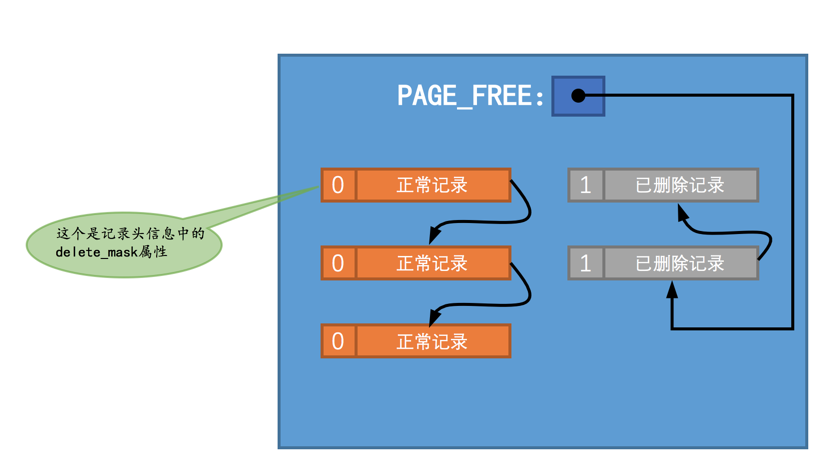
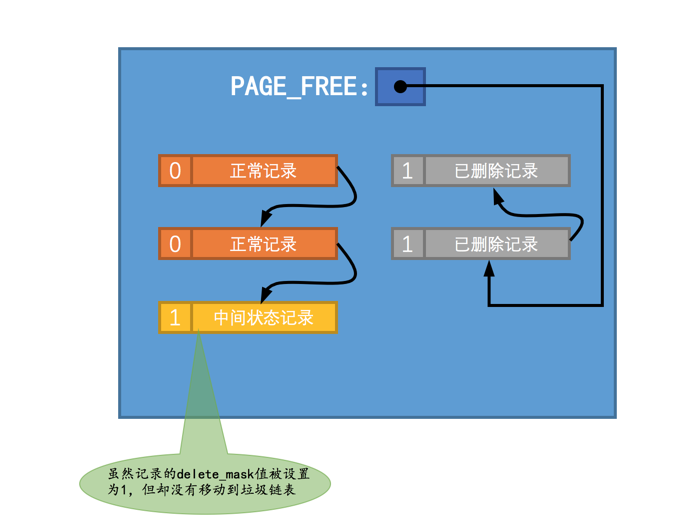
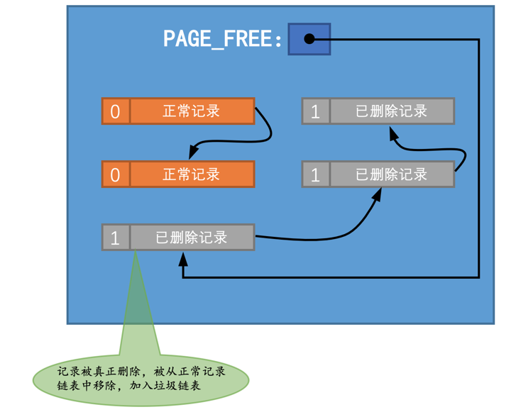
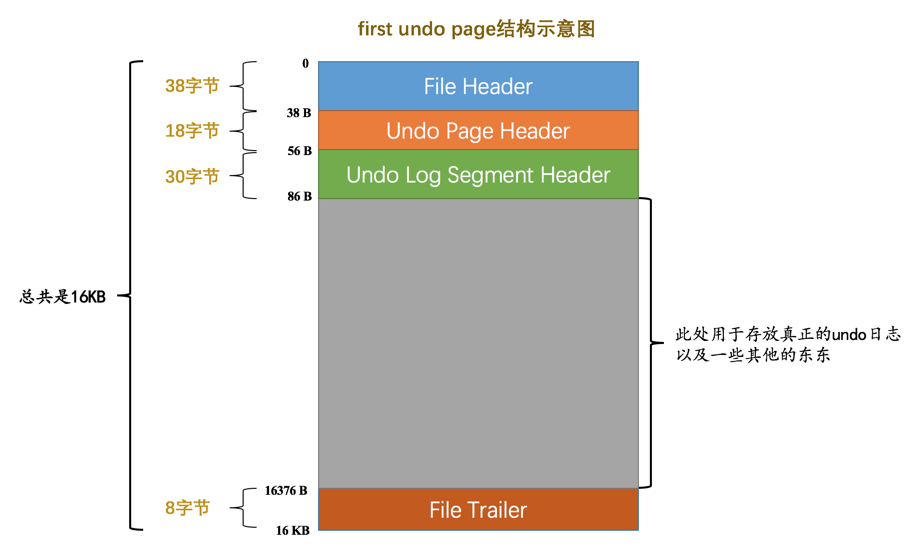

## 事务回滚

​		`事务`需要保证`原子性`，也就是事务中的操作要么全部完成，要么什么也不做。但是有时候事务执行到一半会出现一些情况，比如：

- 事务执行过程中可能遇到各种错误，比如服务器本身的错误，操作系统错误，甚至是突然断电导致的错误。
- 在事务执行过程中手动输入`ROLLBACK`语句结束当前的事务的执行。

这两种情况都会导致事务执行到一半就结束，但是事务执行过程中可能已经修改了很多东西，为了保证事务的原子性，需要把东西改回原先的样子，这个过程就称之为`回滚`（`rollback`）

为了回滚而记录的日志称为撤销日志（undo log），这里需要注意的一点是，由于查询操作（`SELECT`）并不会修改任何用户记录，所以在查询操作执行时，并不需要记录相应的`undo日志`。

## 事务 ID

一个事务可以是一个只读事务，或者是一个读写事务：

- 可以通过`START TRANSACTION READ ONLY`语句开启一个只读事务。

  在只读事务中不可以对普通的表（其他事务也能访问到的表）进行增、删、改操作，但可以对临时表做增、删、改操作。

- 可以通过`START TRANSACTION READ WRITE`语句开启一个读写事务，或者使用`BEGIN`、`START TRANSACTION`语句开启的事务默认也算是读写事务。在读写事务中可以对表执行增删改查操作。

**如果某个事务执行过程中对某个表执行了增、删、改操作，那么`InnoDB`存储引擎就会给它分配一个独一无二的`事务id`**

分配方式如下：

- 对于只读事务，只有在它第一次对某个用户创建的**临时表**执行增、删、改操作时才会为这个事务分配一个`事务id`，否则不分配`事务id`

- 对于读写事务，只有在它第一次对某个表（包括用户创建的临时表）执行增、删、改操作时才会为这个事务分配一个`事务id`，否则也不分配`事务id`。

  > 有的时候虽然我们开启了一个读写事务，但是在这个事务中全是查询语句，并没有执行增、删、改的语句，那也就意味着这个事务并不会被分配一个`事务id`。

### 如何生成事务 ID

`事务id`本质上就是一个数字，它的分配策略和隐藏列`row_id`的分配策略大抵相同：

- 服务器会在内存中维护一个全局变量，每当需要为某个事务分配一个`事务id`时，就会把该变量的值当作`事务id`分配给该事务，并且把该变量自增1。
- 每当这个变量的值为`256`的倍数时，就会将该变量的值刷新到系统表空间的页号为`5`的页面中一个称之为`Max Trx ID`的属性处，这个属性占用`8`个字节的存储空间。
- 当系统下一次重新启动时，会将`Max Trx ID`属性加载到内存中，将该值加上256之后赋值给我们前边提到的全局变量（因为在上次关机时该全局变量的值可能大于`Max Trx ID`属性值）。

这样就可以保证整个系统中分配的`事务id`值是一个递增的数字

### TRX_ID隐藏列

​		`InnoDB`记录行格式提到：聚簇索引的记录会自动添加名为trx_id、roll_pointer的隐藏列：


`trx_id`列记录的就是某个对这个聚簇索引记录做改动的语句所在的事务对应的`事务id`（此处的改动可以是`INSERT`、`DELETE`、`UPDATE`操作）

## Undo 日志格式

​		为了实现事务的`原子性`，`InnoDB`存储引擎在实际进行增、删、改一条记录时，都需要先把对应的`undo日志`记下来。一般每对一条记录做一次改动，就对应着一条`undo日志`，但在**某些更新记录的操作中，也可能会对应着2条`undo日志`**。一个事务在执行过程中可能需要记录很多条对应的`undo日志`，这些`undo日志`会被从`0`开始编号，也就是说根据生成的顺序分别被称为`第0号undo日志`、`第1号undo日志`、...、`第n号undo日志`等，这个编号也被称之为`undo no`。

​		这些`undo日志`是被记录到类型为`FIL_PAGE_UNDO_LOG`（对应的十六进制是`0x0002`）的页面中。这些页面可以从系统表空间中分配，也可以从一种专门存放`undo日志`的表空间，也就是所谓的`undo tablespace`中分配。

```sql
-- 假设创建表
CREATE TABLE undo_demo (
    id INT NOT NULL,
    key1 VARCHAR(100),
    col VARCHAR(100),
    PRIMARY KEY (id),
    KEY idx_key1 (key1)
)Engine=InnoDB CHARSET=utf8;
```

### INSERT日志格式

​		向表中插入一条记录时会有`乐观插入`和`悲观插入`的区分，不管怎么插入，最终导致的结果就是这条记录被放到了一个数据页中。如果希望回滚这个插入操作，那么把这条记录删除就好了，也就是说在写对应的`undo`日志时，主要是把这条记录的主键信息记上。所以设计了一个类型为`TRX_UNDO_INSERT_REC`的`undo日志`，它的完整结构如下图所示：

- undo no：在一个事务中是从`0`开始递增的，只要事务没提交，每生成一条`undo日志`，那么该条日志的`undo no`就增1
- <len,value>列表：用来记录每个主键列占用的存储空间大小和对应的真实值（图中的`len`就代表列占用的存储空间大小，`value`就代表列的真实值）

>  向某个表中插入一条记录时，实际上需要向聚簇索引和所有的二级索引都插入一条记录。不过记录undo日志时，我们**只需要考虑向聚簇索引插入记录时的情况，因为聚簇索引记录和二级索引记录是一一对应的，我们在回滚插入操作时，只需要知道这条记录的主键信息，然后根据主键信息做对应的删除操作，做删除操作时就会顺带着把所有二级索引中相应的记录也删除掉**。（DELETE操作和UPDATE操作对应的undo日志也都是针对聚簇索引记录而言的）

#### ROLL_POINTER隐藏列

roll_pointer 列本质上就是一个**指向记录对应的`undo日志`的指针**。比如向`undo_demo`表里插入了2条记录，每条记录都有与其对应的一条`undo日志`。记录被存储到了类型为`FIL_PAGE_INDEX`的页面中，`undo日志`被存放到了类型为`FIL_PAGE_UNDO_LOG`的页面中。效果如图所示：


### DELETE日志格式

​		数据页中的记录会根据记录头信息中的`next_record`属性组成一个单向链表，这个链表称之为`正常记录链表`；被删除的记录也会根据记录头信息中的`next_record`属性组成一个链表，这个链表中的记录占用的存储空间可以被重新利用，称这个链表为`垃圾链表`。`Page Header`部分有一个`PAGE_FREE`的属性，它指向由被删除记录组成的垃圾链表中的头节点。

​	假设某个时刻页中数据如下：



​	使用`DELETE`语句把`正常记录链表`中的最后一条记录给删除，这个过程需要经历两个阶段：

- 阶段一：仅仅将记录的`delete_mask`标识位设置为`1`，其他的不做修改（其实会修改记录的`trx_id`、`roll_pointer`这些隐藏列的值）。这个阶段称之为`delete mark`

  

  在删除语句所在的事务提交之前，被删除的记录一直都处于这种所谓的`中间状态`

- 阶段二：当该删除语句所在的事务提交之后，会有专门的线程来真正的把记录删除（所谓真正的删除就是把该记录从`正常记录链表`中移除，并且加入到`垃圾链表`中，然后还要调整一些页面的其他信息，比如页面中的用户记录数量`PAGE_N_RECS`、上次插入记录的位置`PAGE_LAST_INSERT`、垃圾链表头节点的指针`PAGE_FREE`、页面中可重用的字节数量`PAGE_GARBAGE`、还有页目录的一些信息等等）。这个阶段称之为`purge`

把`阶段二`执行完了，这条记录就算是真正的被删除掉了。这条已删除记录占用的存储空间也可以被重新利用了：



> ​		被删除记录加入到`垃圾链表`时，实际上加入到链表的头节点处，会跟着修改`PAGE_FREE`属性的值。
>
> ​		页面的Page Header部分有一个PAGE_GARBAGE属性，该属性记录着当前页面中可重用存储空间占用的总字节数。每当有已删除记录被加入到垃圾链表后，都会把这个PAGE_GARBAGE属性的值加上该已删除记录占用的存储空间大小。
>
> ​		PAGE_FREE指向垃圾链表的头节点，之后**每当新插入记录时，首先判断PAGE_FREE指向的头节点代表的已删除记录占用的存储空间是否足够容纳这条新插入的记录，如果不可以容纳，就直接向页面中申请新的空间来存储这条记录**（并不会尝试遍历整个垃圾链表，找到一个可以容纳新记录的节点）。**如果可以容纳，那么直接重用这条已删除记录的存储空间，并且把PAGE_FREE指向垃圾链表中的下一条已删除记录**。
>
> ​		这里有一个问题，如果新插入的那条记录占用的存储空间大小小于垃圾链表的头节点占用的存储空间大小，那就意味头节点对应的记录占用的存储空间里有一部分空间用不到，这部分空间就被称之为**碎片空间**。那这些碎片空间岂不是永远都用不到了么？其实也不是，这些碎片空间占用的存储空间大小会被统计到PAGE_GARBAGE属性中，这些碎片空间在整个页面快使用完前并不会被重新利用，不过**当页面快满时，如果再插入一条记录，此时页面中并不能分配一条完整记录的空间，这时候会首先看一看PAGE_GARBAGE的空间和剩余可利用的空间加起来是不是可以容纳下这条记录，如果可以的话，InnoDB会尝试重新组织页内的记录**：先开辟一个临时页面，把页面内的记录依次插入一遍，因为依次插入时并不会产生碎片，之后再把临时页面的内容复制到本页面，这样就可以把那些碎片空间都解放出来（很显然重新组织页面内的记录比较耗费性能）

​		在删除语句所在的事务提交之前，只会经历`阶段一`，也就是`delete mark`阶段（提交之后就不用回滚了，所以只需考虑对删除操作的`阶段一`做的影响进行回滚）。为此设计了`TRX_UNDO_DEL_MARK_REC`类型的`undo日志`：


- 在对一条记录进行`delete mark`操作前，需要把该记录的旧的`trx_id`和`roll_pointer`隐藏列的值都给记到对应的`undo日志`中来，这样就可以通过`undo日志`的`old roll_pointer`找到记录在修改之前对应的`undo`日志：

  

  > 执行完`delete mark`操作后，它对应的`undo`日志和`INSERT`操作对应的`undo`日志就串成了一个链表。称之为**`版本链`**

- 与类型为`TRX_UNDO_INSERT_REC`的`undo日志`不同，类型为`TRX_UNDO_DEL_MARK_REC`的`undo`日志还多了一个`索引列各列信息`的内容，也就是说如果某个列被包含在某个索引中，那么它的相关信息就应该被记录到这个`索引列各列信息`部分，所谓的相关信息包括该列在记录中的位置（用`pos`表示），该列占用的存储空间大小（用`len`表示），该列实际值（用`value`表示）。所以`索引列各列信息`存储的内容实质上就是`<pos, len, value>`的一个列表。这部分信息主要是用在事务提交后，对该`中间状态记录`做真正删除的阶段二，也就是`purge`阶段中使用的。

### UPDATE 日志格式

`InnoDB`对**更新主键**和**不更新主键**这两种情况有截然不同的处理方案

#### 不更新主键

这种情况下，又可以细分为被更新的列占用的存储空间不发生变化和发生变化的情况：

##### 就地更新

​		更新记录时，**对于被更新的每个列来说，如果更新后的列和更新前的列占用的存储空间都一样大，那么就可以进行`就地更新`**，也就是直接在原记录的基础上修改对应列的值。有任何一个被更新的列更新前比更新后占用的存储空间大，或者更新前比更新后占用的存储空间小都不能进行`就地更新`

##### 先删除旧记录，再插入新记录

​		有任何一个被更新的列更新前和更新后占用的存储空间大小不一致，那么就需要先把这条旧的记录从聚簇索引页面中删除掉，然后再根据更新后列的值创建一条新的记录插入到页面中。

​		**这里的`删除`并不是`delete mark`操作，而是真正的删除掉**，也就是把这条记录从`正常记录链表`中移除并加入到`垃圾链表`中，并且修改页面中相应的统计信息。同时，做真正删除操作的线程并不是在`DELETE`语句中做`purge`操作时使用的另外专门的线程，而是由用户线程同步执行真正的删除操作，真正删除之后紧接着就要根据各个列更新后的值创建的新记录插入。

​		如果新创建的记录占用的存储空间大小不超过旧记录占用的空间，那么可以直接重用被加入到`垃圾链表`中的旧记录所占用的存储空间，否则的话需要在页面中新申请一段空间以供新记录使用，如果本页面内已经没有可用的空间的话，那就需要进行页面分裂操作，然后再插入新记录。


这两种情况的 undo 日志类型为`TRX_UNDO_UPD_EXIST_REC`：


- `n_updated`属性表示本条`UPDATE`语句执行后将有几个列被更新，后边跟着的`<pos, old_len, old_value>`分别表示被更新列在记录中的位置、更新前该列占用的存储空间大小、更新前该列的真实值。
- 如果在`UPDATE`语句中更新的列包含索引列，那么也会添加`索引列各列信息`这个部分

#### 更新主键

​		在聚簇索引中，记录按照主键值的大小连成了一个单向链表，如果更新了某条记录的主键值，意味着这条记录在聚簇索引中的位置将会发生改变，比如将记录的主键值从1更新为10000，如果还有非常多的记录的主键值分布在`1 ~ 10000`之间的话，那么这两条记录在聚簇索引中就有可能离得非常远，甚至中间隔了好多个页面。针对`UPDATE`语句中更新了记录主键值的这种情况，`InnoDB`在聚簇索引中分了两步处理：

- 将旧记录进行**`delete mark`**操作【与不更新主键策略不同】

  在`UPDATE`语句所在的事务提交前，对旧记录只做一个`delete mark`操作，在事务提交后才由专门的线程做purge操作，把它加入到垃圾链表中。

- 根据更新后各列的值创建一条新记录，并将其插入到聚簇索引中（需重新定位插入的位置）

进行`delete mark`操作前，会记录一条类型为`TRX_UNDO_DEL_MARK_REC`的`undo日志`；之后插入新记录时，会记录一条类型为`TRX_UNDO_INSERT_REC`的`undo日志`，也就是说每对一条记录的主键值做改动时，会记录2条`undo日志`

## 通用链表结构


​	在某个表空间内，可以通过一个页的页号和在页内的偏移量来唯一定位一个节点的位置，这两个信息也就相当于指向这个节点的一个指针。

​		为了更好的管理链表，使用基节点的结构，存储了这个链表的`头节点`、`尾节点`以及链表长度信息：


## FIL_PAGE_UNDO_LOG页面

`FIL_PAGE_UNDO_LOG`类型的页面是专门用来存储`undo日志`的，页面的通用结构如下图所示：


### Undo Page Header


- `TRX_UNDO_PAGE_TYPE`：`undo日志`类型，用来标记本页面用于存储哪个大类的`undo日志`，不同大类的`undo日志`不能混着存储。

  上面提到的几种类型的`undo日志`，可以被分为两个大类：

  - `TRX_UNDO_INSERT`：类型为`TRX_UNDO_INSERT_REC`的`undo日志`属于此大类，一般由`INSERT`语句产生，或者在`UPDATE`语句中有更新主键的情况也会产生此类型的`undo日志`。
  - `TRX_UNDO_UPDATE`：除了类型为`TRX_UNDO_INSERT_REC`的`undo日志`，其他类型的`undo日志`都属于这个大类，比如`TRX_UNDO_DEL_MARK_REC`、`TRX_UNDO_UPD_EXIST_REC`，一般由`DELETE`、`UPDATE`语句产生的`undo日志`属于这个大类

- `TRX_UNDO_PAGE_START`：当前页中第一条`undo日志`在本页面中的起始偏移量

- `TRX_UNDO_PAGE_FREE`：当前页中最后一条`undo日志`结束时的偏移量，从这个位置开始，可以继续写入新的undo日志

- `TRX_UNDO_PAGE_NODE`：代表一个`List Node`结构

## Undo 页面链表

### 单个事务中的 Undo页面链表

​		一个事务可能包含多个语句，而且一个语句可能对若干条记录进行改动，而对每条记录进行改动前，都需要记录1条或2条的`undo日志`，所以在一个事务执行过程中可能产生很多`undo日志`，这些日志可能一个页面放不下，需要放到多个页面中，这些页面就通过`TRX_UNDO_PAGE_NODE`属性连成了链表：


> 其中头结点成为 `first undo page`,后面的成为`normal undo page`,头结点中还存储了其他的一些管理信息

在一个事务执行过程中，可能混着执行`INSERT`、`DELETE`、`UPDATE`语句，也就意味着会产生不同类型的`undo日志`。同一个`Undo页面`要么只存储`TRX_UNDO_INSERT`大类的`undo日志`，要么只存储`TRX_UNDO_UPDATE`大类的`undo日志`，所以在一个事务执行过程中就可能需要2个`Undo页面`的链表，一个称之为`insert undo链表`，另一个称之为`update undo链表`，画个示意图就是这样：


`InnoDB`规定对普通表和临时表的记录改动时产生的`undo日志`要分别记录，所以在一个事务中最多有4个以`Undo页面`为节点组成的链表：


并不是在事务一开始就会为这个事务分配这4个链表，而是按需分配，需要的时候才会分配。

### 多个事务中的 Undo页面链表

为了提高`undo日志`的写入效率，不同事务执行过程中产生的undo日志需要被写入到不同的Undo页面链表中

## undo日志写入过程

### 段（Segment）

​		之前提到，`段`是一个逻辑上的概念，本质上是由若干个零散页面和若干个完整的区组成的。比如一个`B+`树索引被划分成两个段，一个叶子节点段，一个非叶子节点段，这样叶子节点就可以被尽可能的存到一起，非叶子节点被尽可能的存到一起。每一个段对应一个`INODE Entry`结构，这个`INODE Entry`结构描述了这个段的各种信息：段的`ID`，段内的各种链表基节点，零散页面的页号有哪些等。为了定位一个`INODE Entry`，InnoDB定义了一个`Segment Header`的结构：


分别记录了表空间ID、页号、页内偏移量，唯一定位一个`INODE Entry`的地址。

### Undo Log Segment Header

`InnoDB`的规定，每一个`Undo页面`链表都对应着一个`段`，称之为`Undo Log Segment`。链表中的页面都是从这个段里边申请的，所以在`Undo页面`链表的第一个页面，也就是`first undo page`中设计了一个称之为`Undo Log Segment Header`的部分，这个部分中包含了该链表对应的段的`segment header`信息以及其他的一些关于这个段的信息，所以`first undo page`如下：



比普通页面多了个`Undo Log Segment Header`：


- `TRX_UNDO_STATE`：本`Undo页面`链表的状态：
  - `TRX_UNDO_ACTIVE`：活跃状态，一个活跃的事务正在往这个段里边写入`undo日志`
  - `TRX_UNDO_CACHED`：被缓存的状态。处在该状态的`Undo页面`链表等待着之后被其他事务重用
  - `TRX_UNDO_TO_FREE`：对于`insert undo`链表来说，如果在它对应的事务提交之后，该链表不能被重用，那么就会处于这种状态。
  - `TRX_UNDO_TO_PURGE`：对于`update undo`链表来说，如果在它对应的事务提交之后，该链表不能被重用，那么就会处于这种状态。
- `TRX_UNDO_LAST_LOG`：`Undo页面`链表中最后一个`Undo Log Header`的位置
- `TRX_UNDO_FSEG_HEADER`：`Undo页面`链表对应的段的`Segment Header`结构
- `TRX_UNDO_PAGE_LIST`：`Undo页面`链表的基节点

