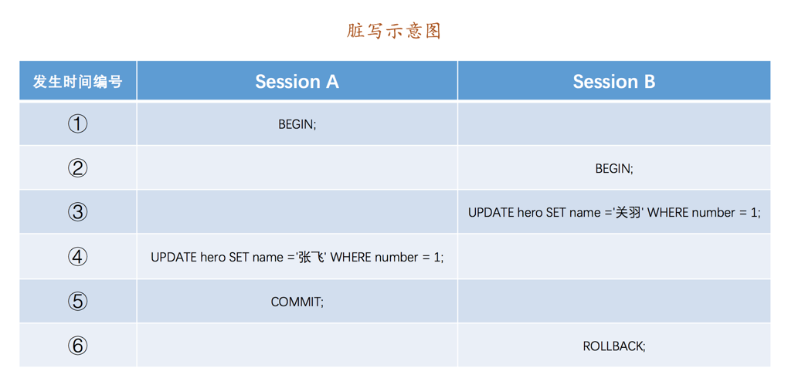
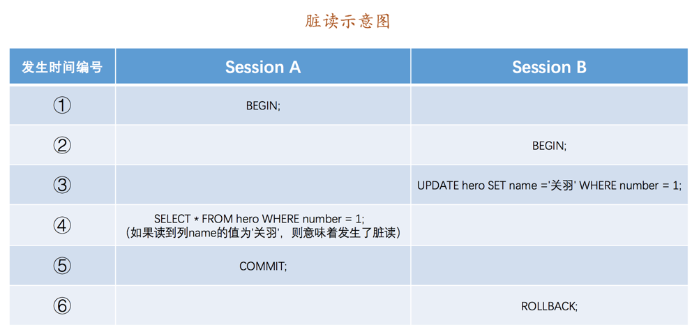
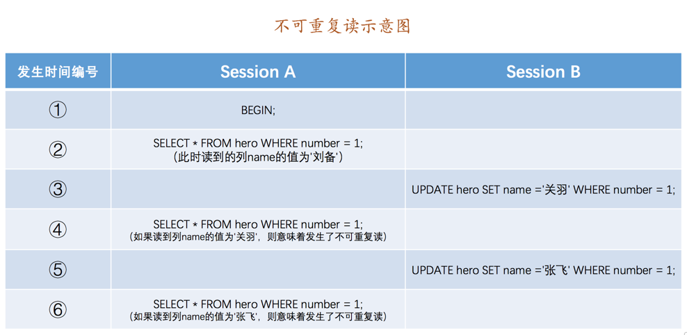
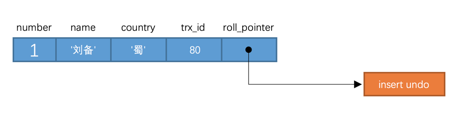
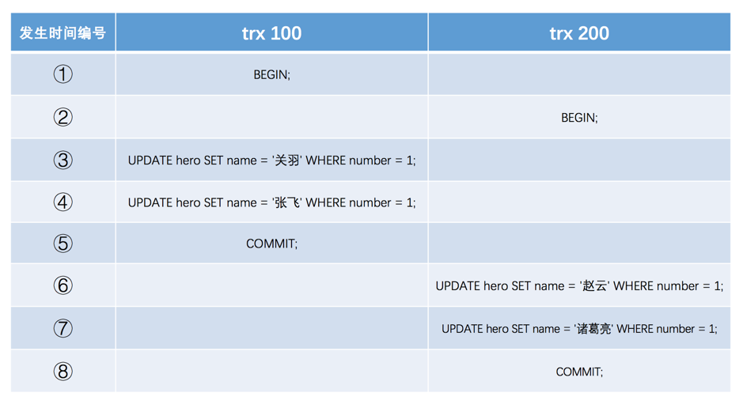
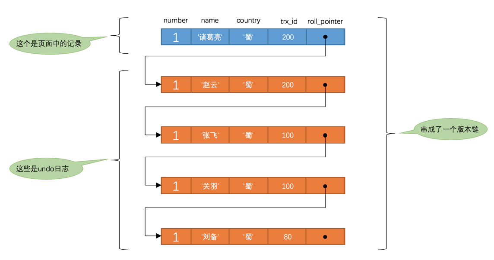

```sql
CREATE TABLE hero (
    number INT,
    name VARCHAR(100),
    country varchar(100),
    PRIMARY KEY (number)
) Engine=InnoDB CHARSET=utf8;
```

## 事务隔离级别

​		`MySQL`是一个`客户端／服务器`架构的软件，对于同一个服务器来说，可以有若干个客户端与之连接，每个客户端与服务器连接上之后，就可以称之为一个会话（`Session`）。每个客户端都可以在自己的会话中向服务器发出请求语句，一个请求语句可能是某个事务的一部分，也就是对于服务器来说可能同时处理多个事务。

​		理论上在某个事务对某个数据进行访问时，其他事务应该进行排队，当该事务提交之后，其他事务才可以继续访问这个数据。但是这样对性能影响太大，既想保持事务的`隔离性`，又想让服务器在处理访问同一数据的多个事务时性能尽量高些，只能舍弃一部分``隔离性`来提高性能。

## 事务并发执行的问题

### 脏写

一个事务修改了另一个未提交事务修改过的数据，那就意味着发生了`脏写`



`Session A`和`Session B`各开启了一个事务，`Session B`中的事务先将`number`列为`1`的记录的`name`列更新为`'关羽'`，然后`Session A`中的事务接着又把这条`number`列为`1`的记录的`name`列更新为`张飞`。如果之后`Session B`中的事务进行了回滚，那么`Session A`中的更新也将不复存在，这种现象就称之为`脏写`。

### 脏读

一个事务读到了另一个未提交事务修改过的数据，那就意味着发生了`脏读`



`Session A`和`Session B`各开启了一个事务，`Session B`中的事务先将`number`列为`1`的记录的`name`列更新为`'关羽'`，然后`Session A`中的事务再去查询这条`number`为`1`的记录，如果读到列`name`的值为`'关羽'`，而`Session B`中的事务稍后进行了回滚，那么`Session A`中的事务相当于读到了一个不存在的数据，这种现象就称之为`脏读`。

### 不可重复读

一个事务只能读到另一个已经提交的事务修改过的数据，并且其他事务每对该数据进行一次修改并提交后，该事务都能查询得到最新值，那就意味着发生了`不可重复读`



​		`Session B`中提交了几个隐式事务（注意是隐式事务，意味着语句结束事务就提交了），这些事务都修改了`number`列为`1`的记录的列`name`的值，每次事务提交之后，如果`Session A`中的事务都可以查看到最新的值，这种现象也被称之为`不可重复读`

​		也就是说，在不可重复读的隔离级别下，当前事务查询的表可以被其他事物修改。

### 幻读

如果一个事务先根据某些条件查询出一些记录，之后另一个事务又向表中**插入**了符合这些条件的记录，原先的事务再次按照该条件查询时，能把另一个事务插入的记录也读出来，那就意味着发生了`幻读`


`Session A`中的事务先根据条件`number > 0`这个条件查询表`hero`，得到了`name`列值为`'刘备'`的记录；之后`Session B`中提交了一个隐式事务，该事务向表`hero`中插入了一条新记录；之后`Session A`中的事务再根据相同的条件`number > 0`查询表`hero`，得到的结果集中包含`Session B`中的事务新插入的那条记录，这种现象也被称之为`幻读`。

> 如果`Session B`中是删除了一些符合`number > 0`的记录而不是插入新记录，那`Session A`中之后再根据`number > 0`的条件读取的记录变少了，这种现象算不算`幻读`呢？
>
> 答：这种现象不属于`幻读`，`幻读`强调的是一个事务按照某个相同条件多次读取记录时，后读取时**读到了之前没有读到的记录**。这种情况相当于对每一条记录都发生了不可重复读的现象。

## SQL 中的四种隔离级别

事务并发下导致的问题按照严重性排序：

脏写 > 脏读 > 不可重复读 > 幻读

因此 SQL 针对以上问题设立了四种隔离级别：

- `READ UNCOMMITTED`：未提交读
- `READ COMMITTED`：已提交读
- `REPEATABLE READ`：可重复读
- `SERIALIZABLE`：可串行化

针对不同的隔离级别，并发事务可以发生不同严重程度的问题：

| 隔离级别 | 脏读 | 不可重复读 | 幻读 |
| -------- | ---- | ---------- | ---- |
| 未提交读 | √    | √          | √    |
| 已提交读 | ×    | √          | √    |
| 可重复读 | ×    | ×          | √    |
| 可串行化 | ×    | ×          | ×    |

> `脏写`问题太严重了，不论是哪种隔离级别，都不允许脏写的情况发生

## MVVC 原理

### 版本链

使用`InnoDB`存储引擎的表来说，它的聚簇索引记录中都包含两个必要的隐藏列：

- `trx_id`：每次一个事务对某条聚簇索引记录进行改动时，都会把该事务的`事务id`赋值给`trx_id`隐藏列。
- `roll_pointer`：每次对某条聚簇索引记录进行改动时，都会把旧的版本写入到`undo日志`中，然后这个隐藏列就相当于一个指针，可以通过它来找到该记录修改前的信息。

假设插入记录的`事务id`为`80`，那么此刻该条记录的示意图如下所示：



假设之后两个`事务id`分别为`100`、`200`的事务对这条记录进行`UPDATE`操作，操作流程如下：



> 不在两个事务中交叉更新同一条记录。因为这就是一个事务修改了另一个未提交事务修改过的数据，也就是`脏写`。InnoDB使用锁来保证不会有脏写情况的发生，也就是在第一个事务更新了某条记录后，就会给这条记录加锁，另一个事务再次更新时就需要等待第一个事务提交了，把锁释放之后才可以继续更新

每次对记录进行改动，都会记录一条`undo日志`，每条`undo日志`也都有一个`roll_pointer`属性（`INSERT`操作对应的`undo日志`没有该属性，因为该记录并没有更早的版本），可以将这些`undo日志`都连起来，串成一个链表：



对该记录每次更新后，都会将旧值放到一条`undo日志`中，就算是该记录的一个旧版本，随着更新次数的增多，所有的版本都会被`roll_pointer`属性连接成一个链表，把这个链表称之为`版本链`，**版本链的头节点就是当前记录最新的值**。另外，每个版本中还包含生成该版本时对应的`事务id`。

### ReadView

​		对于使用`READ UNCOMMITTED`隔离级别的事务来说，由于可以读到未提交事务修改过的记录，所以直接读取记录的最新版本就好了；

​		对于使用`SERIALIZABLE`隔离级别的事务来说，使用加锁的方式来访问记录；

​		对于使用`READ COMMITTED`和`REPEATABLE READ`隔离级别的事务来说，都必须保证读到已经提交了的事务修改过的记录，也就是说假如另一个事务已经修改了记录但是尚未提交，是不能直接读取最新版本的记录的，核心问题就是：**需要判断一下版本链中的哪个版本是当前事务可见的**。为此提出了一个`ReadView`的概念，这个`ReadView`中主要包含4个内容：

- `m_ids`：表示在生成`ReadView`时当前系统中**活跃的读写事务**的`事务id`列表。

- `min_trx_id`：表示在生成`ReadView`时当前系统中活跃的读写事务中最小的`事务id`，也就是`m_ids`中的最小值。

- `max_trx_id`：表示生成`ReadView`时系统中应该分配给**下一个事务**的`id`值。

  > 假如现在有id为1，2，3这三个事务，之后id为3的事务提交了。那么一个新的读事务在生成ReadView时，m_ids就包括1和2，min_trx_id的值就是1，max_trx_id的值就是4

- `creator_trx_id`：表示生成该`ReadView`的事务的`事务id`

  > 只有在对表中的记录做改动时（执行INSERT、DELETE、UPDATE）才会为事务分配事务id，否则在一个只读事务中的事务id值都默认为0


有了`ReadView`，在访问某条记录时，只需要按照下边的步骤判断记录的某个版本是否可见：

- 如果被访问版本的`trx_id`属性值与`ReadView`中的`creator_trx_id`值相同，意味着当前事务在访问它自己修改过的记录，所以该版本可以被当前事务访问。
- 如果被访问版本的`trx_id`属性值小于`ReadView`中的`min_trx_id`值，表明生成该版本的事务在当前事务生成`ReadView`前已经提交，所以该版本可以被当前事务访问。
- 如果被访问版本的`trx_id`属性值大于或等于`ReadView`中的`max_trx_id`值，表明生成该版本的事务在当前事务生成`ReadView`后才开启，所以该版本不可以被当前事务访问。
- 如果被访问版本的`trx_id`属性值在`ReadView`的`min_trx_id`和`max_trx_id`之间，那就需要判断一下`trx_id`属性值是不是在`m_ids`列表中，如果在，说明创建`ReadView`时生成该版本的事务还是活跃的，该版本不可以被访问；如果不在，说明创建`ReadView`时生成该版本的事务已经被提交，该版本可以被访问。

如果某个版本的数据对当前事务不可见的话，那就顺着版本链找到下一个版本的数据，继续按照上边的步骤判断可见性，依此类推，直到版本链中的最后一个版本。如果最后一个版本也不可见的话，那么就意味着该条记录对该事务完全不可见，查询结果就不包含该记录

`READ COMMITTED`和`REPEATABLE READ`隔离级别的的一个非常大的区别就是它们生成ReadView的时机不同：

#### READ COMMITTED —— 每次读取数据前都生成一个ReadView

假如现在系统里有两个`事务id`分别为`100`、`200`的事务在执行：

```sql
-- Transaction 100
BEGIN;

UPDATE hero SET name = '关羽' WHERE number = 1;

UPDATE hero SET name = '张飞' WHERE number = 1;
```

```sql
-- Transaction 200
BEGIN;

-- 更新了一些别的表的记录

```

此刻，表`hero`中`number`为`1`的记录得到的版本链表如下所示：


现在有一个使用`READ COMMITTED`隔离级别的事务开始执行：

```sql
-- 使用READ COMMITTED隔离级别的事务
BEGIN;

-- SELECT1：Transaction 100、200未提交
SELECT * FROM hero WHERE number = 1; 
-- 得到的列name的值为'刘备'
```

SELECT1执行过程如下：

- 在执行`SELECT`语句时会先生成一个`ReadView`，`ReadView`的`m_ids`列表的内容就是`[100, 200]`，`min_trx_id`为`100`，`max_trx_id`为`201`，`creator_trx_id`为`0`（因为当前事务是只读的所以不分配事务 ID）
- 然后从版本链中挑选可见的记录，最新版本的列`name`的内容是`'张飞'`，该版本的`trx_id`值为`100`，在`m_ids`列表内，所以不符合可见性要求，根据`roll_pointer`跳到下一个版本
- 下一个版本的列`name`的内容是`'关羽'`，该版本的`trx_id`值也为`100`，也在`m_ids`列表内，所以也不符合要求，继续跳到下一个版本。
- 下一个版本的列`name`的内容是`'刘备'`，该版本的`trx_id`值为`80`，小于`ReadView`中的`min_trx_id`值`100`，所以这个版本是符合要求的，最后返回给用户的版本就是这条列`name`为`'刘备'`的记录。

现在，把`事务id`为`100`的事务提交一下，然后再到`事务id`为`200`的事务中更新一下表`hero`中`number`为`1`的记录：

```sql
-- Transaction 200
BEGIN;

-- 更新了一些别的表的记录

UPDATE hero SET name = '赵云' WHERE number = 1;

UPDATE hero SET name = '诸葛亮' WHERE number = 1;
```

表`hero`中`number`为`1`的记录的版本链:


然后再到刚才使用`READ COMMITTED`隔离级别的事务中继续查找这个`number`为`1`的记录:

```sql
-- SELECT2：Transaction 100提交，Transaction 200未提交
SELECT * FROM hero WHERE number = 1; 
-- 得到的列name的值为'张飞'
```

`SELECT2`的执行过程如下：

- 在执行`SELECT`语句时会又会单独生成一个`ReadView`，该`ReadView`的`m_ids`列表的内容就是`[200]`（`事务id`为`100`的那个事务已经提交了，所以再次生成快照时就没有它了），`min_trx_id`为`200`，`max_trx_id`为`201`，`creator_trx_id`为`0`。
- 然后从版本链中挑选可见的记录，从图中可以看出，最新版本的列`name`的内容是`'诸葛亮'`，该版本的`trx_id`值为`200`，在`m_ids`列表内，所以不符合可见性要求，根据`roll_pointer`跳到下一个版本。
- 下一个版本的列`name`的内容是`'赵云'`，该版本的`trx_id`值为`200`，也在`m_ids`列表内，所以也不符合要求，继续跳到下一个版本。
- 下一个版本的列`name`的内容是`'张飞'`，该版本的`trx_id`值为`100`，小于`ReadView`中的`min_trx_id`值`200`，所以这个版本是符合要求的，最后返回给用户的版本就是这条列`name`为`'张飞'`的记录。

#### REPEATABLE READ —— 在第一次读取数据时生成一个ReadView

使用`REPEATABLE READ`隔离级别的事务，只会在第一次执行查询语句时生成一个`ReadView`，之后的查询就不会重复生成了

区别在于，当事务 100 提交后，再次执行 SELECT2 时，没有生成新的 ReadView，`m_ids`仍是[100,200],因此按照步骤查询可见版本，结果仍为`刘备`

#### 小结

​		ReadView的存在保证了事务不可以读取到未提交的事务所做的更改，也就是**避免了脏读现象**；REPEATABLE READ隔离级别下，一个事务在执行过程中只有第一次执行SELECT操作才会生成一个ReadView，之后的SELECT操作都复用这个ReadView，这样也就**避免了不可重复读和幻读**的问题。

## Purge

- `insert undo`在事务提交之后就可以被释放掉了，而`update undo`由于还需要支持`MVCC`，不能立即删除掉。
- 为了支持`MVCC`，对于`delete mark`操作来说，仅仅是在记录上打一个删除标记，并没有真正将它删除掉

随着系统的运行，在确定系统中包含最早产生的那个`ReadView`的事务不会再访问某些`update undo日志`以及被打了删除标记的记录后，有一个后台运行的`purge线程`会把它们真正的删除掉。