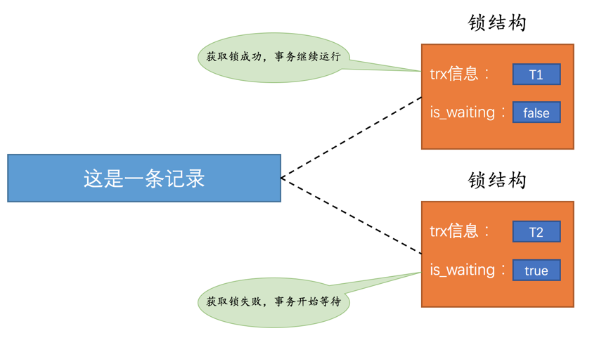
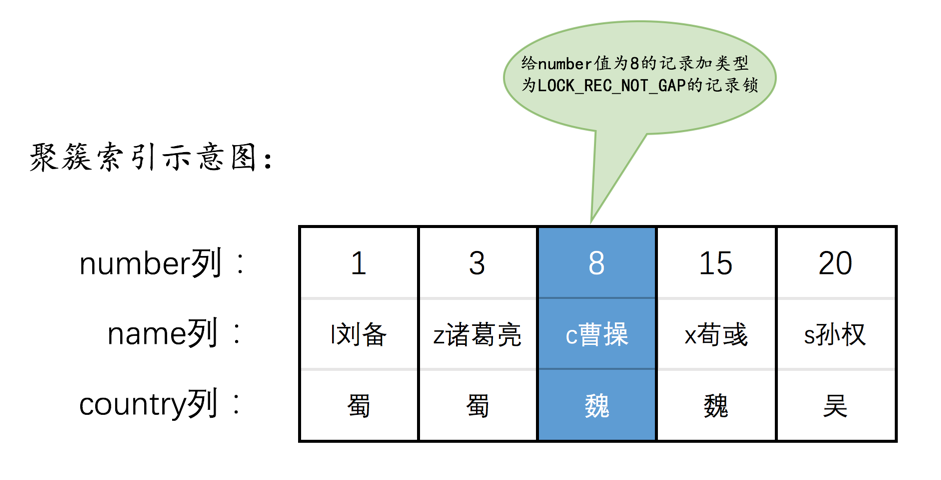
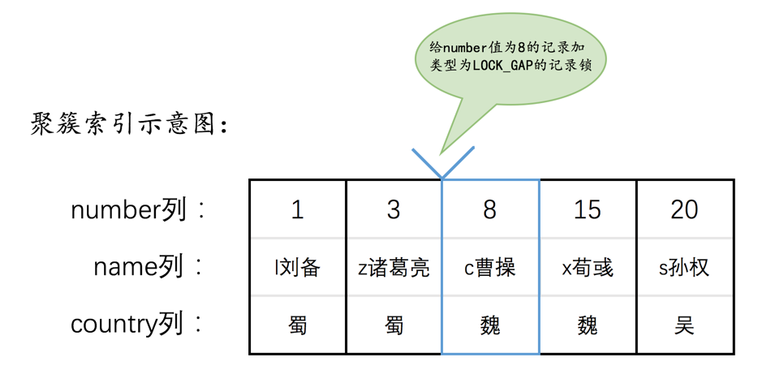
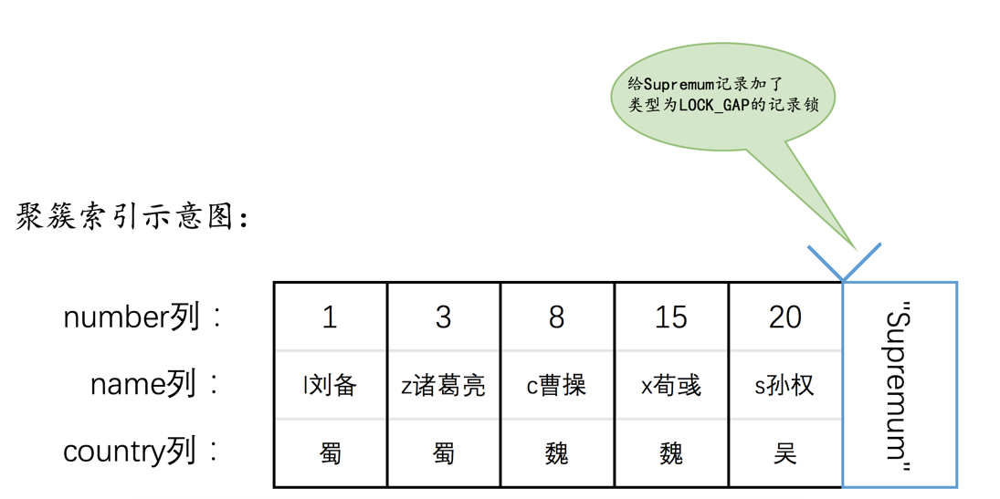
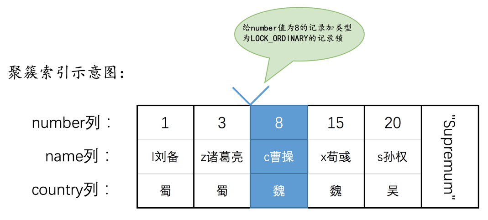
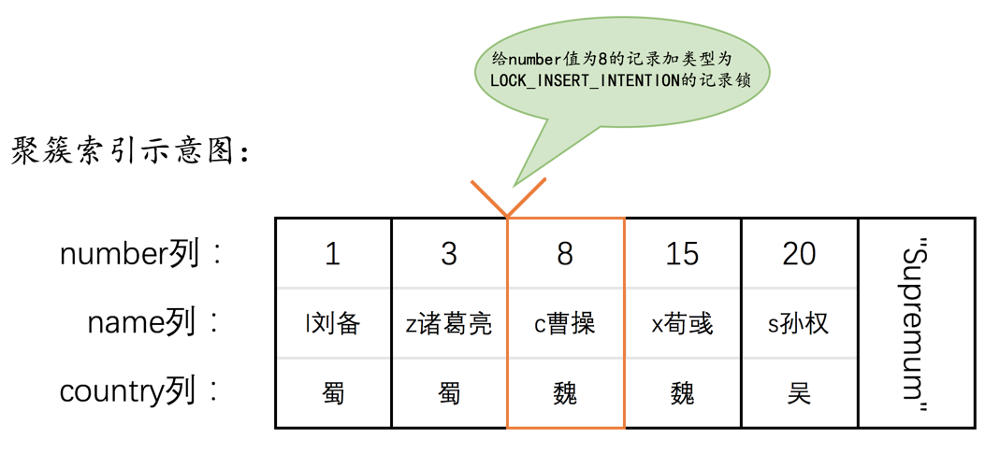
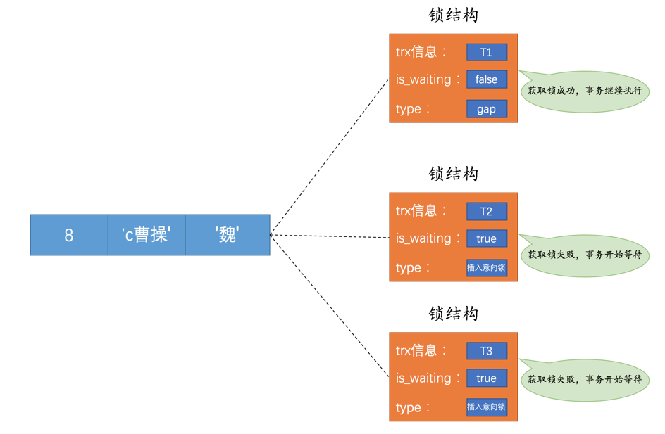
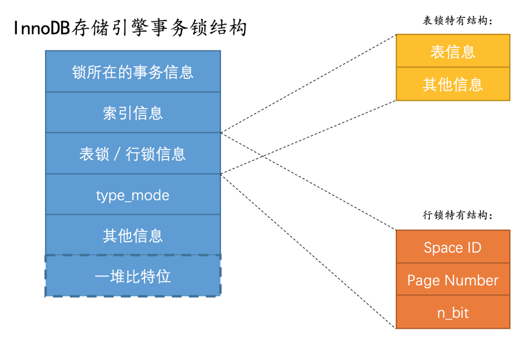
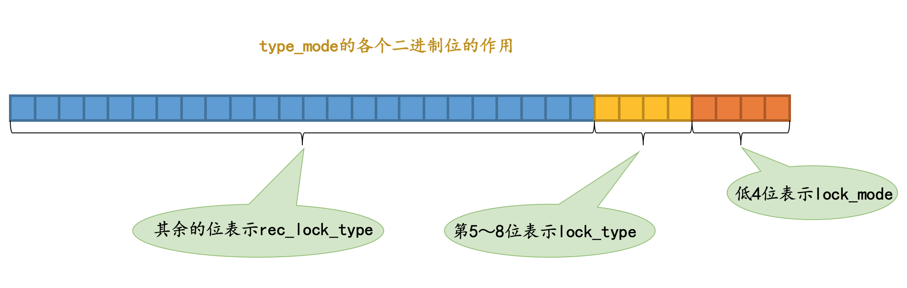

## 解决并发事务的两种方式

并发事务访问相同记录的情况大致可以划分为3种：

- `读-读`情况：即并发事务相继读取相同的记录。

  读取操作本身不会对记录有影响，所以允许这种情况的发生。

- `写-写`情况：即并发事务相继对相同的记录做出改动。

  这种情况下会发生`脏写`的问题，任何一种隔离级别都不允许这种问题的发生。所以在多个未提交事务相继对一条记录做改动时，**需要让它们排队执行**，这个排队的过程是通过`锁`来实现的。这里的`锁`其实是一个内存中的结构，在事务执行前本来是没有锁的，也就是说一开始是没有`锁结构`和记录进行关联的，当一个事务想对这条记录做改动时，首先会看看内存中有没有与这条记录关联的`锁结构`，当没有的时候就会在内存中生成一个`锁结构`与之关联。例如，事务`T1`要对这条记录做改动，就需要生成一个`锁结构`与之关联：

  

  - `trx信息`：代表这个锁结构是哪个事务生成的。
  - `is_waiting`：代表当前事务是否在等待

  之前没有别的事务为这条记录加锁，所以`is_waiting`属性就是`false`，这个场景就称之为**获取锁成功**，然后就可以继续执行操作了。

  在事务`T1`提交之前，另一个事务`T2`也想对该记录做改动，那么先去看看有没有`锁结构`与这条记录关联，发现有一个`锁结构`与之关联后，然后也生成了一个`锁结构`与这条记录关联，不过这个`锁结构`的`is_waiting`属性值为`true`，表示当前事务需要等待，这个场景就称之为获取锁失败：

  

  事务`T1`提交之后，就会把该事务生成的`锁结构`释放掉，然后看看还有没有别的事务在等待获取锁，发现了事务`T2`还在等待获取锁，所以把事务`T2`对应的锁结构的`is_waiting`属性设置为`false`，然后把该事务对应的线程唤醒，让它继续执行。

- `读-写`或`写-读`情况：一个事务进行读取操作，另一个进行改动操作。

  这种情况下可能发生`脏读`、`不可重复读`、`幻读`的问题。

### 解决`脏读`、`不可重复读`、`幻读`

两种方案：

- 方案一：读操作利用多版本并发控制（`MVCC`），写操作进行`加锁`

  `MVVC`就是通过生成一个`ReadView`，找到符合条件的记录版本，查询语句只能读到在生成`ReadView`之前已提交事务所做的更改，在生成`ReadView`之前未提交的事务或者之后才开启的事务所做的更改是看不到的。而写操作肯定针对的是最新版本的记录，读记录的历史版本和改动记录的最新版本本身并不冲突，也就是采用`MVCC`时，`读-写`操作并不冲突

- 方案二：读、写操作都采用`加锁`的方式。

  如果一些业务场景不允许读取记录的旧版本，而是每次都必须去读取记录的最新版本，这样在读取记录的时候也就需要对其进行`加锁`操作，这样也就意味着`读`操作和`写`操作也像`写-写`操作那样排队执行

很明显，采用`MVCC`方式的话，`读-写`操作彼此并不冲突，性能更高，采用`加锁`方式的话，`读-写`操作彼此需要排队执行，影响性能。一般情况下采用`MVCC`来解决`读-写`操作并发执行的问题，但是业务在某些特殊情况下，要求必须采用`加锁`的方式执行。

## 一致性读

​		事务利用`MVCC`进行的读取操作称之为`一致性读`，或者`一致性无锁读`，也称之为`快照读`。所有普通的`SELECT`语句（`plain SELECT`）在`READ COMMITTED`、`REPEATABLE READ`隔离级别下都算是`一致性读`。

`一致性读`并不会对表中的任何记录做`加锁`操作，其他事务可以自由的对表中的记录做改动

## 锁定读

### 共享锁和独占锁

​		并发事务的`读-读`情况并不会引起什么问题，不过对于`写-写`、`读-写`或`写-读`这些情况可能会引起一些问题，需要使用`MVCC`或者`加锁`的方式来解决。在使用`加锁`的方式解决问题时，由于既要允许`读-读`情况不受影响，又要使`写-写`、`读-写`或`写-读`情况中的操作相互阻塞，所以给锁分了个类：

- 共享锁：`Shared Locks`，简称`S锁`。在事务要读取一条记录时，需要先获取该记录的`S锁`。
- 独占锁：也常称`排他锁`，`Exclusive Locks`，简称`X锁`。在事务要改动一条记录时，需要先获取该记录的`X锁`

| 兼容性 | X    | S    |
| ------ | ---- | ---- |
| **X**  | ×    | ×    |
| S      | ×    | √    |

### 锁定读

- 对读取的记录加`S锁`：

  ```sql
  SELECT ... LOCK IN SHARE MODE;
  ```

  `SELECT`语句后边加`LOCK IN SHARE MODE`，如果当前事务执行了该语句，那么它会为读取到的记录加`S锁`，这样允许别的事务继续获取这些记录的`S锁`，但是不能获取这些记录的`X锁`。如果别的事务想要获取这些记录的`X锁`，那么它们会阻塞，直到当前事务提交之后将这些记录上的`S锁`释放掉

- 对读取的记录加`X锁`：

  ```sql
  SELECT ... FOR UPDATE;
  ```

  `SELECT`语句后边加`FOR UPDATE`，如果当前事务执行了该语句，那么它会为读取到的记录加`X锁`，这样既不允许别的事务获取这些记录的`S锁`，也不允许获取这些记录的`X锁`。如果别的事务想要获取这些记录的`S锁`或者`X锁`，那么它们会阻塞，直到当前事务提交之后将这些记录上的`X锁`释放掉

### 写操作

- `DELETE`：

  先在`B+`树中定位到这条记录的位置，然后获取一下这条记录的`X锁`，然后再执行`delete mark`操作。这个定位待删除记录在`B+`树中位置的过程可以看成是一个获取`X锁`的`锁定读`。

- `UPDATE`：

  在对一条记录做`UPDATE`操作时分为三种情况：

  - 如果未修改该记录的键值并且被更新的列占用的存储空间在修改前后未发生变化，则先在`B+`树中定位到这条记录的位置，然后再获取一下记录的`X锁`，最后在原记录的位置进行修改操作。也可以把这个定位待修改记录在`B+`树中位置的过程看成是一个获取`X锁`的`锁定读`。
  - 如果未修改该记录的键值并且至少有一个被更新的列占用的存储空间在修改前后发生变化，则先在`B+`树中定位到这条记录的位置，然后获取一下记录的`X锁`，将该记录彻底删除掉（就是把记录彻底移入垃圾链表），最后再插入一条新记录。这个定位待修改记录在`B+`树中位置的过程看成是一个获取`X锁`的`锁定读`，新插入的记录由`INSERT`操作提供的`隐式锁`进行保护。
  - 如果修改了该记录的键值，则相当于在原记录上做`DELETE`操作之后再来一次`INSERT`操作，加锁操作就需要按照`DELETE`和`INSERT`的规则进行了。

- `INSERT`：

  一般情况下，新插入一条记录的操作并不加锁，`InnoDB`通过一种称之为`隐式锁`的方式来保护这条新插入的记录在本事务提交前不被别的事务访问

## 多粒度锁

​		上面提到的`锁`都是针对记录的，也可以被称之为`行级锁`或者`行锁`，对一条记录加锁影响的也只是这条记录而已，行锁的粒度比较细；一个事务也可以在`表`级别进行加锁，称之为`表级锁`或者`表锁`，对一个表加锁影响整个表中的记录，表锁的粒度比较粗。给表加的锁也可以分为`共享锁`（`S锁`）和`独占锁`（`X锁`）

## 意向锁

在对某个表上`表锁`时，怎么知道该表中有没有记录已经被上`行锁`了呢？依次检查每条记录有没有上`行锁`？这样的效率太低。因此提出了意向锁的概念：

- 意向共享锁，`Intention Shared Lock`，简称`IS锁`：当事务准备在某条记录上加`S锁`时，需要先在表级别加一个`IS锁`。
- 意向独占锁，`Intention Exclusive Lock`，简称`IX锁`：当事务准备在某条记录上加`X锁`时，需要先在表级别加一个`IX锁`

IS、IX锁是表级锁，它们的提出仅仅为了在之后加表级别的S锁和X锁时可以快速判断表中的记录是否被上锁，以避免用遍历的方式来查看表中有没有上锁的记录，而对某个记录上行锁其实是不关心表级是否有意向锁的。

**表级别**的兼容性：

| 兼容性 | X    | IX   | S    | IS   |
| ------ | ---- | ---- | ---- | ---- |
| **X**  | ×    | ×    | ×    | ×    |
| **IX** | ×    | √    | ×    | √    |
| **S**  | ×    | ×    | √    | √    |
| **IS** | ×    | √    | √    | √    |

## InnoDB存储引擎中的锁

​		`InnoDB`存储引擎既支持表锁，也支持行锁。表锁实现简单，占用资源较少，不过粒度很粗，性能比较差。行锁粒度更细，可以实现更精准的并发控制。

### InnoDB中的表级锁

- 表级别的`S锁`、`X锁`

  在对某个表执行`SELECT`、`INSERT`、`DELETE`、`UPDATE`语句时，`InnoDB`存储引擎是不会为这个表添加表级别的`S锁`或者`X锁`的。

  另外，在对某个表执行一些诸如`ALTER TABLE`、`DROP TABLE`这类的`DDL`语句时，其他事务对这个表并发执行诸如`SELECT`、`INSERT`、`DELETE`、`UPDATE`的语句会发生阻塞，同理，某个事务中对某个表执行`SELECT`、`INSERT`、`DELETE`、`UPDATE`语句时，在其他会话中对这个表执行`DDL`语句也会发生阻塞。这个过程其实是通过在`server层`使用一种称之为`元数据锁`（`Metadata Locks`，简称`MDL`）来实现的，一般情况下也不会使用`InnoDB`存储引擎自己提供的表级别的`S锁`和`X锁`。`InnoDB`存储引擎提供的表级`S锁`或者`X锁`只会在一些特殊情况下，比如崩溃恢复过程中用到。

- 表级别的`IS锁`、`IX锁`

  当我们在对使用`InnoDB`存储引擎的表的某些记录加`S锁`之前，那就需要先在表级别加一个`IS锁`，当我们在对使用`InnoDB`存储引擎的表的某些记录加`X锁`之前，那就需要先在表级别加一个`IX锁`。`IS锁`和`IX锁`的使命只是为了后续在加表级别的`S锁`和`X锁`时判断表中是否有已经被加锁的记录，以避免用遍历的方式来查看表中有没有上锁的记录。更多关于`IS锁`和`IX锁`的解释我们上边都唠叨过了，就不赘述

- 表级别的`AUTO-INC锁`

  在使用`MySQL`过程中，我们可以为表的某个列添加`AUTO_INCREMENT`属性，之后在插入记录时，可以不指定该列的值，系统会自动为它赋上递增的值

### InnoDB中的行级锁

#### 记录锁（Record Locks）

仅仅把一条记录锁上，也叫做`LOCK_REC_NOT_GAP`（非间隙锁）

记录锁有`S锁`和`X锁`之分。



#### 间隙锁（Gap Locks）

​		`MySQL`在`REPEATABLE READ`隔离级别下是可以解决幻读问题的，解决方案有两种，可以使用`MVCC`方案解决，也可以采用`加锁`方案解决。

​		事务在第一次执行读取操作时，那些幻影记录尚不存在，无法给这些幻影记录加上`记录锁`。因此提出了一种称之为`Gap Locks`的锁，`LOCK_GAP`，简称为`gap锁`



​		为`number`值为`8`的记录加了`gap锁`，意味着不允许别的事务在`number`值为`8`的记录前边的`间隙`插入新记录，其实就是`number`列的值`(3, 8)`这个区间的新记录是不允许立即插入的。比方说有另外一个事务再想插入一条`number`值为`4`的新记录，它定位到该条新记录的下一条记录的`number`值为8，而这条记录上又有一个`gap锁`，所以就会阻塞插入操作，直到拥有这个`gap锁`的事务提交了之后，`number`列的值在区间`(3, 8)`中的新记录才可以被插入。

​		`gap锁`的提出仅仅是为了防止插入幻影记录而提出的，虽然有`共享gap锁`和`独占gap锁`这样的说法，但是它们起到的作用都是相同的。而且如果对一条记录加了`gap锁`（不论是`共享gap锁`还是`独占gap锁`），并不会限制其他事务对这条记录加`记录锁`或者继续加`gap锁`，`gap锁`的作用仅仅是为了防止插入幻影记录的而已。

​		为了实现阻止其他事务插入`number`值在`(20, +∞)`这个区间的新记录，可以给索引中的最后一条记录，也就是`number`值为`20`的那条记录所在页面的`Supremum`记录加上一个`gap锁`



#### Next-Key Locks

​		如果既想锁住某条记录，又想阻止其他事务在该记录前边的`间隙`插入新记录，`InnoDB`提出了一种称之为`Next-Key Locks`的锁。



`next-key锁`的本质就是一个`记录锁`和一个`gap锁`的合体，它既能保护该条记录，又能阻止别的事务将新记录插入被保护记录前边的`间隙`。

#### Insert Intention Locks

​		一个事务在插入一条记录时需要判断一下插入位置是不是被别的事务加了所谓的`gap锁`（`next-key锁`也包含`gap锁`），如果有的话，插入操作需要等待，直到拥有`gap锁`的那个事务提交。`InnoDB`规定事务在等待的时候也需要在内存中生成一个`锁结构`，表明有事务想在某个`间隙`中插入新记录，但是现在在等待。这种类型的锁命名为`Insert Intention Locks`，官方的类型名称为：`LOCK_INSERT_INTENTION`，也可以称为`插入意向锁`。



例如，现在`T1`为`number`值为`8`的记录加了一个`gap锁`，然后`T2`和`T3`分别想向`hero`表中插入`number`值分别为`4`、`5`的两条记录，所以现在为`number`值为`8`的记录加的锁的示意图就如下所示：



#### 隐式锁

​		一个事务在执行`INSERT`操作时，如果即将插入的`间隙`已经被其他事务加了`gap锁`，那么本次`INSERT`操作会阻塞，并且当前事务会在该间隙上加一个`插入意向锁`，否则**一般情况下`INSERT`操作是不加锁的**。那如果一个事务首先插入了一条记录（此时并没有与该记录关联的锁结构），然后另一个事务：

- 立即使用`SELECT ... LOCK IN SHARE MODE`语句读取这条记录，也就是在要获取这条记录的`S锁`，或者使用`SELECT ... FOR UPDATE`语句读取这条记录，也就是要获取这条记录的`X锁`，该咋办？

  如果允许这种情况的发生，那么可能产生`脏读`问题。

- 立即修改这条记录，也就是要获取这条记录的`X锁`，该咋办？

  如果允许这种情况的发生，那么可能产生`脏写`问题。

此时，`事务id`又要起作用了：

- 情景一：对于聚簇索引记录来说，有一个`trx_id`隐藏列，记录着最后改动该记录的`事务id`。那么如果在当前事务中新插入一条聚簇索引记录后，该记录的`trx_id`隐藏列代表的的就是当前事务的`事务id`，如果其他事务此时想对该记录添加`S锁`或者`X锁`时，首先会**看一下该记录的`trx_id`隐藏列代表的事务是否是当前的活跃事务，如果是的话，那么就帮助当前事务创建一个`X锁`**（也就是为当前事务创建一个锁结构，`is_waiting`属性是`false`），然后自己进入等待状态（也就是为自己也创建一个锁结构，`is_waiting`属性是`true`）。
- 情景二：对于二级索引记录来说，本身并没有`trx_id`隐藏列，但是在二级索引页面的`Page Header`部分有一个`PAGE_MAX_TRX_ID`属性，该属性代表对该页面做改动的最大的`事务id`，如果`PAGE_MAX_TRX_ID`属性值小于当前最小的活跃`事务id`，那么说明对该页面做修改的事务都已经提交了，否则就需要在页面中定位到对应的二级索引记录，然后回表找到它对应的聚簇索引记录，然后再重复`情景一`的做法

也就是说，**一个事务对新插入的记录可以不显式的加锁（生成一个锁结构）**，但是由于`事务id`存在，相当于加了一个`隐式锁`。别的事务在对这条记录加`S锁`或者`X锁`时，由于`隐式锁`的存在，会先帮助当前事务生成一个锁结构，然后自己再生成一个锁结构后进入等待状态。

> 由于插入的记录无法被提前加锁（之前不存在这个记录），因此通过聚簇索引记录中的事务 id隐式的加了一个“锁”，这个锁不是由插入时的事务加的，而是别的事务访问时，看一下这个记录的事务 id 是否仍在活跃（即，该事务没有提交），是的话，就为它添加一个锁，然后给自己再加一个锁。

### InnoDB锁的内存结构

对一条记录加锁的本质就是在内存中创建一个`锁结构`与之关联，那么是不是一个事务对多条记录加锁，就要创建多个`锁结构`呢？

```sql
-- 事务T1
SELECT * FROM hero LOCK IN SHARE MODE;
```

对不同记录加锁时，如果符合下边这些条件：

- 在同一个事务中进行加锁操作
- 被加锁的记录在同一个页面中
- 加锁的类型是一样的
- 等待状态是一样的

那么这些记录的锁就可以被放到一个`锁结构`中



- `锁所在的事务信息`：

  不论是`表锁`还是`行锁`，都是在事务执行过程中生成的，哪个事务生成了这个`锁结构`，这里就记载着这个事务的信息。

- `索引信息`：

  对于`行锁`来说，需要记录一下加锁的记录是属于哪个索引的

- `表锁／行锁信息`：

  - 表锁：

    记载着这是对哪个表加的锁，还有其他的一些信息。

  - 行锁：

    记载了三个重要的信息：

    - `Space ID`：记录所在表空间。
    - `Page Number`：记录所在页号。
    - `n_bits`：对于行锁来说，一条记录就对应着一个比特位，一个页面中包含很多记录，用不同的比特位来区分到底是哪一条记录加了锁。为此在行锁结构的末尾放置了一堆比特位，这个`n_bits`属性代表使用了多少比特位。

- `type_mode`：

  这是一个32位的数，被分成了`lock_mode`、`lock_type`和`rec_lock_type`三个部分：

  

  - 锁的模式（`lock_mode`）：
    - `LOCK_IS`（十进制的`0`）：表示共享意向锁，也就是`IS锁`。
    - `LOCK_IX`（十进制的`1`）：表示独占意向锁，也就是`IX锁`。
    - `LOCK_S`（十进制的`2`）：表示共享锁，也就是`S锁`。
    - `LOCK_X`（十进制的`3`）：表示独占锁，也就是`X锁`。
    - `LOCK_AUTO_INC`（十进制的`4`）：表示`AUTO-INC锁`
  - 锁的类型（`lock_type`）：
    - `LOCK_TABLE`（十进制的`16`），也就是当第5个比特位置为1时，表示表级锁。
    - `LOCK_REC`（十进制的`32`），也就是当第6个比特位置为1时，表示行级锁
  - 行锁的具体类型（`rec_lock_type`）：只有在`lock_type`的值为`LOCK_REC`时，也就是只有在该锁为行级锁时，才会被细分为更多的类型：
    - `LOCK_ORDINARY`（十进制的`0`）：表示`next-key锁`。
    - `LOCK_GAP`（十进制的`512`）：也就是当第10个比特位置为1时，表示`gap锁`。
    - `LOCK_REC_NOT_GAP`（十进制的`1024`）：也就是当第11个比特位置为1时，表示`记录锁`。
    - `LOCK_INSERT_INTENTION`（十进制的`2048`）：也就是当第12个比特位置为1时，表示插入意向锁。
    - `WAIT`（十进制的`256`） ：也就是当第9个比特位置为`1`时，表示`is_waiting`为`true`，也就是当前事务尚未获取到锁，处在等待状态；当这个比特位为`0`时，表示`is_waiting`为`false`，也就是当前事务获取锁成功。


